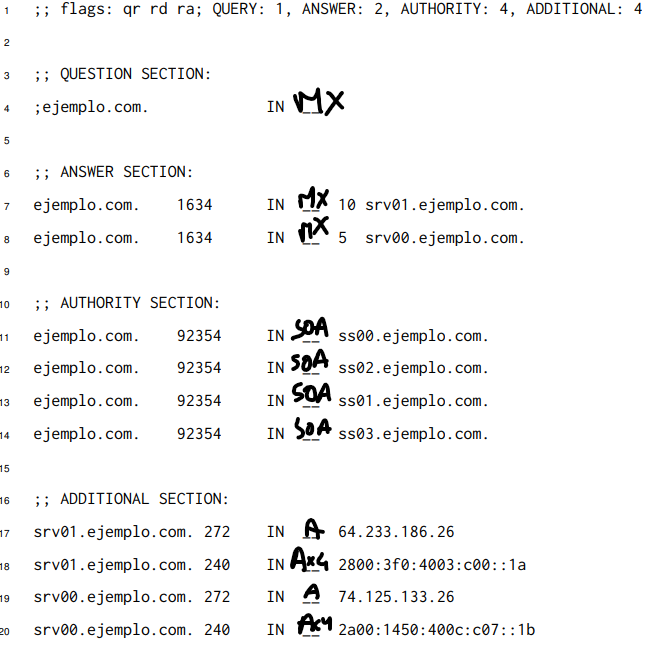

# Práctica para el parcial

## Parciales

## Parcial 1era fecha primer semestre 2022

### PDF adjunto en carpeta _pdfs_

### 1.

a.

- Registros A: www
- Registros MX: mail
- Registros NS: ns1 y ns2
- Registros CNAME: ftp "sharedfolder"
- Registros SOA: ns1 y ns2

b. Se conecta un nuevo usuario al que llamaremos PC-G. Su dirección de red será: 192.0.2.133/25

c. En el caso de que la solicitud pueda acceder a cualquiera de los 2 host www, iria al más cercano. De igual manera depende todo de la tabla de ruteo de los dispositivos ya que esta debe contemplar alguno para poder accederlo.

d. El protocolo permitirá buscar el sitio según el método que contenga el requerimiento y la direccion consultada.

### 2.

a. Las direcciones IP que tiene el host A son: 192.168.22.15 y 127.0.0.1.

b. Corresponde a la fase del cierre de 4 fases. En la fase TIME-WAIT el cliente esta esperando el FIN del servidor para finalizar la conexión (previamente el cliente mando un FIN).

i. Si mando el FIN_WAIT_1 (manda un FIN) y recibo el ACK, pasa a TIME-WAIT.
ii. Si desde FIN_WAIT_1 envio FIN y no recibo nada, paso a FIN_WAIT_2 y envio de nuevo el FIN

c.

i. 192.168.22.20.35794 > 192.168.22.20.80: FLAGS [S], seq 110012, ack 0

ii. 192.168.22.20.35794 > 192.168.22.20.9100: UDP, length 1024

iii. 192.168.22.20.33444 > 192.168.22.20.8080: FLAGS [S], seq 552201, ack 0

### 3.

a. Ubico el problema en TCP. El problema esta del lado del servidor ya que calculó mal el ACK, en vez de ser 558012 tuvo que ser 558013 ya que el ACK se calcula sumando 1 al numero de secuencia del cliente.

b. Se logro enviar el request y la respuesta es un error 500 (error del servidor).

### 4.

Se puede agrupar, ya que hasta el bit numero 20 son iguales:

- 113.33.215.0/24 - 113.33.1101 0111.0/24
- 113.33.216.0/24 - 113.33.1101 1000.0/24
- 113.33.217.0/24 - 113.33.1101 1001.0/24
- 113.33.218.0/23 - 113.33.1101 1010.0/23

Entonces quedaria: 113.33.208.0/20

### 5.

Empezamos por la red más grande, en este caso red C:

13.14.56.0/23

00001101 00001110 00111000 00000000

11111111 11111111 11111110 00000000

Si quisiera hacer una división fija no puedo ya que no me alcanzan las redes (en este caso son 2).

- Red C: como con 2 a la 7 no me alcanza para 192 hosts, elijo 8 bits de hosts (254 hosts)
  13.14.00111000.0 --> Red C: 13.14.56.0/24
  13.14.00111001.0 --> ???: 13.14.57.0/24 (LIBRE)

- Red A: elijo 7 bits de hosts (126 hosts) que me alcanza para 117 hosts. Utilizo la red que me sobro de la red C: 13.14.00111001.0/24
  13.14.00111001.0 0000000/25 --> Red A: 13.14.56.0/25
  13.14.00111001.1 0000000/25 --> ???: 13.14.56.128/25 (LIBRE)

- Red B: elijo 7 bits (126 hosts) que me alcanza para 97 hosts. Utilizo la red que me sobro del subnetting de la red A:
  13.14.00111001.1 0000000/25 --> Red B: 13.14.56.128/25

### 6.

???

### 7.

- Paquete 1: se envia por la interfaz eth0
- Paquete 2: se envia por la interfaz eth2
- Paquete 3: se envia por la interfaz eth2

**NO SE SACAR LA MAC**

### 8.

a. No se cómo hacer el ARP Request

b. paja

c. pc-B hubiera escuchado cuando pc-A pedia la IP de pc-C.

## Ejercicios de las practicas

## TP2 - EJ DE PARCIAL

a. HTTP 1.1 (Debido al _Connection: close_ y el host del request).

b. Utiliza el método HEAD, dicho método no retorna el recurso completo de hecho lo excluye de la respuesta.

c. Se solicita el header de www.redes.unlp.edu.ar ❌ ESTA MAL, la rta correcta es: solicita el recurso /metodos/.

d. Si, funcionó correctamente ya que devolvió un 200 OK.

e. La respuesta hubiera sido un 304 Not modified, esto es debido a que la comparacion es menor estricta. El navegador cargará la información cargada en caché.

## TP3 - EJ DE PARCIAL

a.

**nota: Ax4 representa AAAA pero no me entraba**

b. No es una respuesta autoritativa (no tiene el flag aa). Le preguntaría a un servidor cualquiera de los que se enlistan en la AUTHORITY SECTION.

c. Tanto la consulta como la respuesta fueron recursivas (flags ra y rd).

d. Los valores 10 y 5 en las líneas 7 y 8 representan la prioridad de los servidores de correo, en caso de que se quiera acceder se va a acceder al de mayor prioridad (valor menor), si este no podria aceptar la solicitud se accederia al siguiente respestando la prioridad.
