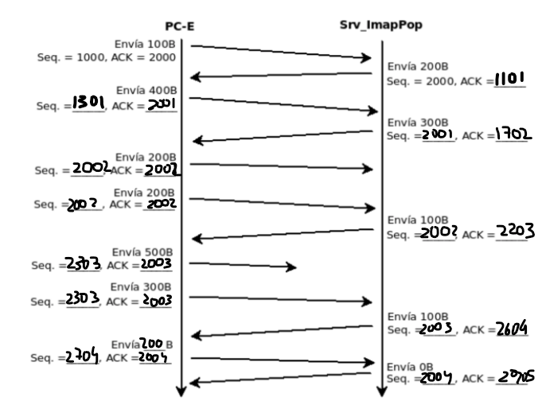
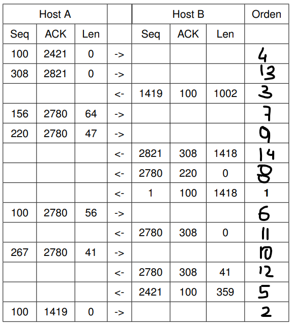

# Práctica para el parcial

## Parciales

## Parcial 1era fecha primer semestre 2022

### PDF adjunto en carpeta _pdfs_

### 1.

a.

- Registros A: www
- Registros MX: mail
- Registros NS: ns1 y ns2
- Registros CNAME: ftp "sharedfolder"
- Registros SOA: ns1 y ns2

b. Se conecta un nuevo usuario al que llamaremos PC-G. Su dirección de red será: 192.0.2.133/25

c. En el caso de que la solicitud pueda acceder a cualquiera de los 2 host www, iria al más cercano. De igual manera depende todo de la tabla de ruteo de los dispositivos ya que esta debe contemplar alguno para poder accederlo.

d. El protocolo permitirá buscar el sitio según el método que contenga el requerimiento y la direccion consultada.

### 2.

a. Las direcciones IP que tiene el host A son: 192.168.22.15 y 127.0.0.1.

b. Corresponde a la fase del cierre de 4 fases. En la fase TIME-WAIT el cliente esta esperando el FIN del servidor para finalizar la conexión (previamente el cliente mando un FIN).

i. Si mando el FIN_WAIT_1 (manda un FIN) y recibo el ACK, pasa a TIME-WAIT.
ii. Si desde FIN_WAIT_1 envio FIN y no recibo nada, paso a FIN_WAIT_2 y envio de nuevo el FIN

c.

i. 192.168.22.20.35794 > 192.168.22.20.80: FLAGS [S], seq 110012, ack 0

ii. 192.168.22.20.35794 > 192.168.22.20.9100: UDP, length 1024

iii. 192.168.22.20.33444 > 192.168.22.20.8080: FLAGS [S], seq 552201, ack 0

### 3.

a. Ubico el problema en TCP. El problema esta del lado del servidor ya que calculó mal el ACK, en vez de ser 558012 tuvo que ser 558013 ya que el ACK se calcula sumando 1 al numero de secuencia del cliente.

b. Se logro enviar el request y la respuesta es un error 500 (error del servidor).

### 4.

Se puede agrupar, ya que hasta el bit numero 20 son iguales:

- 113.33.215.0/24 - 113.33.1101 0111.0/24
- 113.33.216.0/24 - 113.33.1101 1000.0/24
- 113.33.217.0/24 - 113.33.1101 1001.0/24
- 113.33.218.0/23 - 113.33.1101 1010.0/23

Entonces quedaria: 113.33.208.0/20

### 5.

Empezamos por la red más grande, en este caso red C:

13.14.56.0/23

00001101 00001110 00111000 00000000

11111111 11111111 11111110 00000000

Si quisiera hacer una división fija no puedo ya que no me alcanzan las redes (en este caso son 2).

- Red C: como con 2 a la 7 no me alcanza para 192 hosts, elijo 8 bits de hosts (254 hosts)
  13.14.00111000.0 --> Red C: 13.14.56.0/24
  13.14.00111001.0 --> ???: 13.14.57.0/24 (LIBRE)

- Red A: elijo 7 bits de hosts (126 hosts) que me alcanza para 117 hosts. Utilizo la red que me sobro de la red C: 13.14.00111001.0/24
  13.14.00111001.0 0000000/25 --> Red A: 13.14.56.0/25
  13.14.00111001.1 0000000/25 --> ???: 13.14.56.128/25 (LIBRE)

- Red B: elijo 7 bits (126 hosts) que me alcanza para 97 hosts. Utilizo la red que me sobro del subnetting de la red A:
  13.14.00111001.1 0000000/25 --> Red B: 13.14.56.128/25

### 6.

???

### 7.

- Paquete 1: se envia por la interfaz eth0
- Paquete 2: se envia por la interfaz eth2
- Paquete 3: se envia por la interfaz eth2

**NO SE SACAR LA MAC**

### 8.

a. No se cómo hacer el ARP Request

b. paja

c. pc-B hubiera escuchado cuando pc-A pedia la IP de pc-C.

## Parcial 2da fecha primer semestre 2022

### 1.

a. a.riu.edu.ar deberia poner como servidor SOA y NS y como CNAME al servidor web-prin.

b. ns1 y ns-res tendrán un intercambio DNS cuando un cliente haga consultas recursivas a ns-res y ns-red hará las consultas iterativas correspondientes para llegar a ns1 (primero consulta a NS .edu.ar).

c. Porque pasar el archivo entero sería muy pesado por lo que el emisor lo codifica a un texto más liviano y le deja la tarea de decodificarlo al receptor.

d.
GET /index.html HTTP/1.1
Host: wp1.redes.edu.ar
Connection: close / keep-alive
User-agente: browser

e. En caso de que el servidor establezca la conexión primero si podrian intercambiar datos.

### 2.

a. Llego el segmento SYN de parte del cliente y no llego el SYNACK del servidor al cliente.

b. Se esta intentando conectar al protocolo POP3 de la capa de aplicacion a traves de TCP en la capa de transporte.

c.

- a. 190.0.0.1.110 > 190.0.11.1.35794 : Flags [SA], seq 1, ack 920152 + 1
- b. 127.0.0.1.110 > 127.0.0.1.12345: Flags [SA], seq 1, ack 110012 + 1
- c. _NO HAY RESPUESTA, SOLO DEVOLVERIA SI EL PUERTO ESTA OCUPADO_

### 3.

### 4.

180.96.0.0/11

10101010 01100000 00000000 00000000
11111111 11111111 00000000 00000000 MASCARA DE RED B
11111111 11100000 00000000 00000000 MASCARA DE SUBRED

10101010 01111111 00000000 00000000 Ultima dirección de red --> 180.127.0.0/11

### 5.

**Usamos subnetting fijo**

206.58. 110 00000.0/19 --> Si tengo que hacer redes que alojen 700 hosts necesito 10 bits

- 206.58. 110 000 00.00000000/22 --> Red 1 --> 206.58.192.0/22 (voy a tener 2^3 subredes)
- 206.58. 110 001 00.00000000/22 --> Red 2 --> 206.58.193.0/22
- 206.58. 110 010 00.00000000/22 --> Red 3 --> 206.58.194.0/22

### 6.

a. De pc-A va a ir al router 1 por eth0, del router 1 va a ir a pc-B por eth0.

b. De pc-A va a ir al router 1 por eth0, del router 1 va a ir al ruter 3 por eth0 y del router 3 va a ir a www por eth2.

c.

| Dispositivo | Interfaz | IP          | Mask | Gateway    |
| ----------- | -------- | ----------- | ---- | ---------- |
| PC-A        | e1       | 10.3.0.66   | /22  | 10.0.144.1 |
| PC-B        | e4       | 10.0.144.53 | /22  | 0          |

**no sabemos si se agrega el router o no**

d. **no sé**

## Parcial 3era fecha primer semestre 2022

### 1.

a. Deberia configurar el registro A de ns1 que apunta a web-prin: `203.0.113.229`. Quedando: (wp1.redes.edu.ar A 203.0.113.229)

b. Se capturó la versión HTTP 1.1, esta versión permite conexiones persistentes y pipelining (se pueden solicitar recursos sin haber obtenido una confirmación del anterior).

c. Utilizaria el protocolo SMTP para la transferencia de los correos en la red y el protocolo POP3 para la recepción y manejo de correos.

(mail-1.redes.edu.ar A 203.0.113.227)
(redes.edu.ar MX 5 mail-1.redes.edu.ar)

(mail-2.redes.edu.ar A 198.51.100.133)
(redes.edu.ar MX 10 mail-2.redes.edu.ar)

d. El problema puede ser que tanto PC-D quieren una conexión activa con el servidor y como PC-E ya la tiene pudo haberle asignado un puerto que quizás es el mismo que quiere conectarse PC-D. La solución que se me ocurre es pedir una conexión pasiva desde PC-D o activa pero en otro puerto.

### 2.

a. El host esta indicando con `win=0` que no tiene más espacio para recibir datos.

b. El host Z podría establecer una conexión ya que esta iniciandola desde un puerto local nuevo, que no está en uso.

c. No se toma ningúna acción ya que UDP es _best-effort_ y no garantiza la recepción de los mensajes.

### 3.

a.

- Protocolo: TCP
- Direccion origen y puerto: 192.168.8.253:16367
- Direccion destino y puerto: 192.168.8.15:9999
- Flags: SYN
- Numero de seq: 3230256110
- ACK: 0

b.

- Protocolo: TCP
- Direccion origen y puerto: 127.0.0.1:9050
- Direccion destino y puerto: 127.0.0.1:1918
- Flags: SYN/ACK
- Numero de seq: 0
- ACK: 1

c.

- Protocolo: UDP
- Direccion origen 192.168.8.253
- Direccion destino: 192.168.8.15
- Puerto: 9
- Flags: _no corresponde_
- Numero de seq: _no corresponde_
- ACK: _no corresponde_

### 4.

a. 48 clientes (creo que es por la cantidad de puertos del switch pero no estoy segura)

b. `192.168.12.128/25` hay que asignarla a A (18), B (13) y C (15).

- Comienzo por el cliente con más hosts que es el A. Necesito 5 bits, en total serán 2^5 - 2 = 30 hosts:

`192.168.12.100 00000` --> La red entonces será: `192.168.12.128/27`
`192.168.12.10100000` a `192.168.12.11100000` estarán libres, en total 2^2 subredes siendo que una ya esta utilizada.

- Sigo con el cliente C. Necesito 5 bits, en total serán 2^5 - 2 = 30 hosts. Tomo la primer red libre que sobro del subnetting anterior: `192.168.12.10100000` --> `192.168.12.160/27`

- Finalmente, el cliente B es el que menos hosts precisa: con 4 bits me alcanza, en total serán 2^4 - 2 = 14 hosts.

Tomo la segunda red libre que sobro del subnetting anterior: `192.168.12.1100 0000` --> `192.168.12.192/28`

c. Si, se puede. El CIDR sería:

- `192.168.12.1 0000000`
- `192.168.12.1 0100000`
- `192.168.12.1 1000000`
- `192.168.12.1 1100000`

El bloque CIDR sería: `192.168.12.128/25`

### 5.

a.

- pc-b envia un `echo request` a 10.0.7.20/24
- el mensaje llega al router 2 donde evalua en su tabla de ruteo si está la dirección de pc-c haciendo un AND con las mascaras y como ninguna coincide sigue por el default-gateway (0.0.0.0)
- del router2 el mensaje llega al router1 por la interfaz eth0; el router1 busca una coincidencia en su tabla de routeo y la encuentra con el destino `10.0.0.0` cuya mascara es `/16`, toma el gateway que le corresponde --> direccion del router3
- en el router3 encuentra una coincidencia en la interfaz eth2 y envia el mensaje

b.

- pc-c envia un `echo request` a 10.0.5.20/24
- el mensaje llega al router3 y no lo encuentra, asi que lo manda por el default gateway al router 4 por el eth0
- el mensaje llega al router4 y coincide con el destino `10.0.0.0` cuya mascara es `/18`
- el mensaje llega al router2 y como tiene una coincidencia con la ip de pc-b le manda el mensaje por la interfaz eth2

c.

- pc-c al router3
- router3 por el default gateway va al router4 por eth0
- router4 lo descarta porque no existen coincidencias --> msj de error: `ICMP Destination Network Unreachable`

d.

- pc-b al router2
- router2 por el default gateway va al router1 por eth0
- router1 y router2 se quedan en bucle hasta que el TTL sea 0 (fueron restando el TTL) --> msj de error: `ICMP Destination Host Unreachable`

### 6.

a. ??? XD

b. La red IPv6 utiliza direcciones MAC en las tramas de Ethernet.

c. ??? XD

d. El tamaño maximo de una trama está dado por el MTU (Maximum Transmission Unit), que tiene un valor de 1500 aunque generalmente se utiliza 1460 bytes. El MSS (Maximum Segment Size) indica el tamaño máximo que tendrá un segmento en la capa de transporte para poder entrar en una MTU, suele ser de 40 bytes.

## Ejercicios de las practicas

## TP2 - EJ DE PARCIAL

a. HTTP 1.1 (Debido al _Connection: close_ y el host del request).

b. Utiliza el método HEAD, dicho método no retorna el recurso completo de hecho lo excluye de la respuesta.

c. Se solicita el header de www.redes.unlp.edu.ar ❌ ESTA MAL, la rta correcta es: solicita el recurso /metodos/.

d. Si, funcionó correctamente ya que devolvió un 200 OK.

e. La respuesta hubiera sido un 304 Not modified, esto es debido a que la comparacion es menor estricta. El navegador cargará la información cargada en caché.

## TP3 - EJ DE PARCIAL

a.

**nota: Ax4 representa AAAA pero no me entraba**

b. No es una respuesta autoritativa (no tiene el flag aa). Le preguntaría a un servidor cualquiera de los que se enlistan en la AUTHORITY SECTION.

c. Tanto la consulta como la respuesta fueron recursivas (flags ra y rd).

d. Los valores 10 y 5 en las líneas 7 y 8 representan la prioridad de los servidores de correo, en caso de que se quiera acceder se va a acceder al de mayor prioridad (valor menor), si este no podria aceptar la solicitud se accederia al siguiente respestando la prioridad.

## TP4 - EJ Ejercicio integrador HTTP, DNS y MAIL (10)

a. Para hacer visible el dominio a Internet hay que registrar todos los servidores del dominio.

b. Creemos que los registros son 1 por cada servidor DNS.

| Nombre del registro | Tipo de registro | Prioridad | TTL | Valor del registro |
| ------------------- | ---------------- | --------- | --- | ------------------ |
| ns1                 | NS               | ?         | ?   | ?                  |
| ns2                 | NS               | ?         | ?   | ?                  |

c. Es necesario que el servidor DNS acepte consultas recursivas para permitir que los dispositivos en la red del servidor puedan comunicarse entre ellos pasandose información.

d y e.

- ns1: DNS - Puerto UDP 53
- ns2: DNS - Puerto UDP 53
- mail: SMTP - Puerto TCP 25 y IMAP (porque es mejor que POP3) - Puerto 143 **necesita IMAP??**
- correo (WEB): HTTP - Puerto TCP 80 e IMAP

f. El webmail utilizaria el protocolo SMTP para conectarse con el servidor de correo.

g. En un registro TXT hay que agregar una configuración SPF en la que se incluyan los servidores de correo deseados. Creo que no afectaria a los mails enviados desde el Webmail porque debe existir una manera de configurar la dirección IP de salida.

h. El MIME (Multipurpose Internet Mail Extensions) son una serie de convenciones o especificaciones dirigidas al intercambio a través de Internet de todo tipo de archivos de forma transparente para el usuario.

**Nos da paja hacer el i, j, k, l y m**

## TP6 - EJ 15 y 16

### 15.

1.

- Responde un paquete ICMP --> PORT UNREACHABLE

- Responde con flag RA

- Responde con flag SA

- Responde con flag RA

2. Hay 4 conexiones establecidas (EN EL LISTADO APARECEN 5 ESTAB PERO SON 4 PORQUE HAY UNA CONEXIÓN LOCAL: de ruby a mysqld y viceversa).

### 16.

## TP10 - EJ 12

a. Se da cuenta porque aplica su máscara de red en su propia IP y en la IP destino y obtiene distinto resultado.

b. Necesita la dirección _default gateway_.

c.

    Trama Ethernet: (mac origen: *MAC PC-A* mac destino: *MAC del router*)
    Solicitud ARP: (mac origen: *MAC PC-A* ip origen: *IP PC-A*)
                   (mac destino: *0* ip destino: *IP default gateway*)

d.

    Trama Ethernet: (mac origen: *MAC PC-A* mac destino: *MAC del router*)
    Solicitud ARP: (ip origen: *IP PC-A* ip destino: *IP default gateway*)
