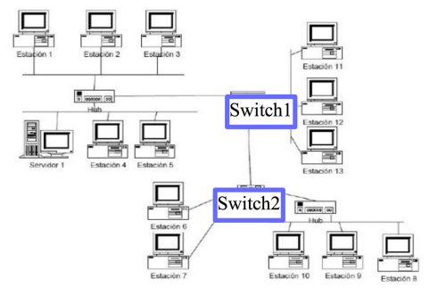
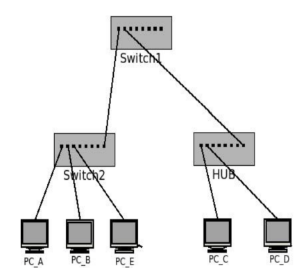
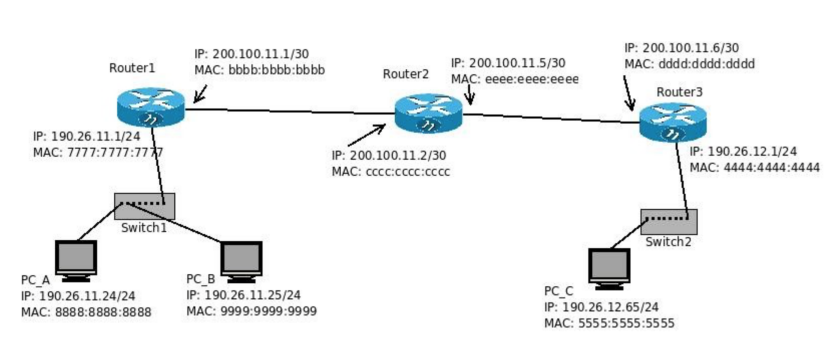

## Práctica 10 - Capa de Enlace - Parte I

### 1. ¿Qué función cumple la capa de enlace? Indique qué servicios presta esta capa.

La capa de enlace se encarga de la comunicación directa entre dispositivos. El protocolo de la capa de enlace define el formato de los paquetes intercambiados por los nodos situados en los extremos del enlace, así como las acciones que estos nodos llevan a cabo cuando se envían y reciben los paquetes.

La PDU de la capa de enlace se denominan tramas (frames), y cada trama de la capa de enlace suele encapsular un datagrama de la capa de red.

Mientras que la capa de red tiene asignada la tarea de mover los segmentos de la capa de transporte terminal a terminal desde el host de origen hasta el host destino, el protocolo de la capa de enlace tiene la tarea nodo a nodo, algo más simple, de mover los datagramas de la capa de red a través de un único enlace dentro de una ruta. Un mismo datagrama de la capa de enlace puede ser transportado por diferentes protocolos de la capa de enlace en los distintos enlaces que forman la ruta. Es importante observar que los servicios proporcionados por los diferentes protocolos de la capa de enlace a lo largo de la ruta terminal a terminal pueden ser distintos.

Aunque el servicio básico de cualquier capa de enlace es mover un datagrama desde un nodo hasta
otro adyacente a través de un único enlace de comunicaciones, los detalles del servicio proporcionado pueden variar de un protocolo de la capa de enlace a otro. Entre los posibles servicios que un protocolo de la capa de enlace puede ofrecer se incluyen:

- _Entramado_. Casi todos los protocolos de la capa de enlace encapsulan cada datagrama de la capa de red dentro de una trama de la capa de enlace antes de transmitirla a través del enlace. Una trama consta de un campo de datos, en el que se inserta el datagrama de la capa de red, y de una serie de campos de cabecera (una trama también puede incluir campos de cola).
- _Acceso al enlace_. Un protocolo de control de acceso al medio (MAC, Medium Access Control) especifica las reglas que se utilizan para transmitir una trama a través de un enlace.
- _Entrega fiable_. Cuando un protocolo de la capa de enlace proporciona un servicio de entrega fiable, garantiza que va a transportar cada datagrama de la capa de red a través del enlace sin errores.
- _Detección y corrección de errores._ El hardware de la capa de enlace en un nodo receptor pudiera llegar a decidir, incorrectamente, que un bit contenido en una trama es cero cuando fue transmitido como un uno, y viceversa. Dichos errores de bit se introducen debido a la atenuación de las señales y al ruido electromagnético. Puesto que no hay necesidad de reenviar un datagrama que contenga un error, muchos protocolos de la capa de enlace proporcionan un mecanismo para detectar dichos errores de bit.

### 2. Compare los servicios de la capa de enlace con los de la capa de transporte.

Muchos de los servicios proporcionados por la capa de enlace presentan notables paralelismos con los servicios proporcionados en la capa de transporte. Por ejemplo, el servicio de entrega fiable. Aunque los mecanismos utilizados para esto son similares en las dos capas, no son idénticos. Un protocolo de transporte proporciona una entrega fiable de segmentos entre dos procesos, en modo terminal a terminal; un protocolo de la capa de enlace fiable proporciona una entrega fiable de tramas entre dos nodos conectados por un único enlace. De forma similar, los protocolos de la capa de transporte como los de la capa de enlace pueden proporcionar servicios de control de flujo y detección de errores, pero de nuevo el control de flujo en un protocolo de la capa de transporte se proporciona en modo terminal a terminal, mientras que en un protocolo de la capa de enlace se proporciona entre dos nodos adyacentes.

### 3. Direccionamiento Ethernet:

### ¿Cómo se identifican dos máquinas en una red Ethernet?

Se identifican mediante una dirección MAC (media access control).

### ¿Cómo se llaman y qué características poseen estas direcciones?

La dirección consta de 6 bytes de longitud, lo que da `2^48` posibles direcciones de MAC. Suelen expresarse en notación hexadecimal, indicándose cada byte de la dirección mediante una pareja de números hexadecimales. Una propiedad de las direcciones MAC es que nunca puede haber dos adaptadores con la misma dirección, para esto la IEEE se encarga de gestionar el espacio de direcciones MAC.

### ¿Cuál es la dirección de broadcast en capa de enlace? ¿Qué función cumple?

Al ser una tecnología broadcast todos los nodos escuchan todo. En el caso de Ethernet realiza la difusión recibiendo tramas con dirección MAC de destino `FF.FF.FF.FF.FF.FF`.

### 4. Sobre los dispositivos de capa de enlace:

### Enumere dispositivos de capa de enlace y explique sus diferencias.

La capa de enlace posee 2 dispositivos:

- **Hub**: Repetidores de la capa física. Todos los dispositivos de una red están conectados al Hub. Cuando un dispositivo envía un frame, el Hub lo retransmite hacia todos los demás dispositivos de la red a la misma velocidad. Al tener todos los nodos conectados y no haber buffering pueden causarse colisiones; para controlar y evitar colisiones se puede utilizar un protocolo llamado _CSMA/CD_. Un Hub tiene topologia estrella. Es no deterministico y si tiene muchos dispositivos conectados puede ser lento.
- **Switch**: Es la evolución del Hub. Permite múltiples transmisiones simultaneas, envía los datos provenientes de la computadora de origen solamente a la computadora de destino. Los host se conectan a un switch y el switch hace buffering entre sus hosts. No existen las colisiones. Un switch interconecta dispositivos de una red pero no rutea. El switch conoce dispositivos y genera la tabla de dispositivos al hacerlo, si tiene que mandar información de un nodo a otro y no lo conoce o no tiene en su tabla dirección del segundo nodo entonces tiene que enviarlo por broadcast/multicast, es decir, simulando el funcionamiento de un Hub. Si se envía la información y tiene en su tabla la dirección del segundo nodo, entonces sólo ese nodo recibirá esa información puesto que lo conoce y sabe a quién enviársela.

### ¿Qué es una colisión?

Una colisión se produce cuando la información de un dispositivos se mezcla con la de otro. Un dominio de colisión es un segmento físico de una red de computadores donde es posible que las tramas puedan "colisionar" (interferir) con otros.

### ¿Qué dispositivos dividen dominios de broadcast?

Dominio de Broadcast es un conjunto de todos los dispositivos que reciben tramas de broadcast que se originan en cualquier dispositivo del conjunto. Los conjuntos de broadcast generalmente están limitados por routers dado que los router no envían tramas de broadcast.

Hay un dominio de broadcast para todos los hosts y uno por cada router conectado.

### ¿Qué dispositivos dividen dominios de colisión?

El área de red donde se originan las tramas y se producen las colisiones se denomina dominio de colisiones. Todos los entornos de los medios compartidos, como aquellos creados mediante el uso de hubs, son dominios de colisión. Cuando un host se conecta a un puerto de switch, el switch crea una conexión dedicada. Esta conexión se considera como un dominio de colisiones individual, dado que el tráfico se mantiene separado de cualquier otro y, por consiguiente, se eliminan las posibilidades de colisión.

### 5. Describa el algoritmo de acceso al medio en Ethernet. ¿Es orientado a la conexión?

En un entorno de medios compartidos, todos los dispositivos tienen acceso garantizado al medio, pero no tienen ninguna prioridad en dicho medio. Si más de un dispositivo realiza una transmisión simultáneamente, las señales físicas colisionan y la red debe recuperarse para que pueda continuar la comunicación. Las colisiones representan el precio que debe pagar la Ethernet para obtener la sobrecarga baja que se relaciona con cada transmisión. Ethernet utiliza el acceso múltiple por detección de portadora y detección de colisiones (CSMA/CD) para detectar y manejar colisiones. Para transmitir, el adaptador sondea el medio compartido (no utiliza ningún "slot”, ranura o partición de tiempo, frecuencia o código), es decir, utiliza un mecanismo de detección de colisiones. Si está ocupado, espera hasta que se libere; si está libre, comienza a transmitir la trama. Durante la transmisión se compara la señal en el medio con la transmitida –otro nodo puede haber sensado el canal libre y comenzado a transmitir, detectándose después de un intervalo por el tiempo de propagación del medio-.

Si se transmite toda la trama sin detectar colisión: se considera transmisión exitosa. Si se detecta colisión: se aborta la transmisión de la trama, se envía al medio una señal de bloqueo, asegura que todos los nodos detecten la colisión. Y se espera antes de volver a intentar retransmitir la señal un tiempo aleatorio que puede ser mayor según la cantidad de colisiones detectadas.

Ethernet no es orientado a conexión y no es confiable (no hay acks/nacks).

Los pasos son:

- El adaptador recibe un datagrama de la capa de red y crea la trama.
- Si el adaptador sensa que el canal está libre, éste comienza a transmitir la trama. Si éste sensa canal ocupado, espera hasta que esté libre y transmite.
- Si el adaptador transmite la trama entera sin detectar colisión, se considera transmisión lograda.
- Si el adaptador detecta otra transmisión mientras transmite, aborta y envía una señal de bloqueo (jam)
- Después de abortar, el adaptador entra en backoff exponencial: después de la m- ésima colisión, el adaptador elige un K aleatorio entre {0, 1, 2, …, 2^m-1}. El adaptador espera K·512 periodos de 1 bit y retorna al paso 2.

### 6. ¿Cuál es la finalidad del protocolo ARP?

ARP es un protocolo utilizado por los dispositivos que usan el protocolo IP en la capa de red. Funciona de manera similar a un Switch de Ethernet. Se encarga de asignar las direcciones IPv6 y las direcciones MAC correspondientes, o de consultar sobre las direcciones IP de otro dispositivo; tanto las asignaciones como las consultas se inician en Broadcast, hasta que se obtiene la dirección concreta del dispositivo, que el destinatario de esa IP le responde directamente.

### 7. Dado el siguiente esquema de red, responda:

### a. Suponiendo que las tablas de los switches están llenas con la información correcta, responda quién escucha el mensaje si:

### i. La estación 1 envía una trama al servidor 1.

Estaciones 2, 3, 4 y 5, servidor 1 y switch 1.

### ii. La estación 1 envía una trama a la estación 11.

Estaciones 2, 3, 4, 5 y 11, servidor 1 y switch 1. **CONSULTAR SI LOS SERVIDORES 1 Y ESTACIONES 4 Y 5 TMB**

### iii. La estación 1 envía una trama a la estación 9.

Estaciones 2, 3, 4, 5, 8, 9 y 10, servidor 1 y switch 1. **IDEM ARRIBA**

### iv. La estación 4 envía una trama a la MAC de broadcast.

Todos?? **CONSULTAR**

### v. La estación 6 envía una trama a la estación 7.

Estacion 7 y switch 2.

### vi. La estación 6 envía una trama a la estación 10.

Estaciones 8, 9 y 10, switch 2.

### b. ¿En qué situaciones se podrían producir colisiones?

En todas menos de la estacion 6 a la 7. **CONSULTAR**

### 8. En la siguiente topología de red indique:

### a. ¿Cuántos dominios de colisión hay?

Existe un dominio de colisión por cada nodo conectado, en este caso serían 7. **CONSULTAR**

### b. ¿Cuántos dominios de broadcast hay?

Hay un dominio de broadcast para todos los hosts, en este caso serian 3. **CONSULTAR**

### c. Indique cómo se va llenando la tabla de asociaciones MAC ->PORT de los switches SW1 y SW2 durante el siguiente caso:

**CONSULTAR: A esto se refiere a cómo va conociendo el switch 1 al switch2 y el hub??**

### i. A envía una solicitud ARP consultando la MAC de C.

### ii. C responde esta solicitud ARP.

### iii. A envía una solicitud ARP consultando la MAC de B.

### iv. B responde esta solicitud ARP.

### d. Si la PC E y la PC D hubiesen estado ejecutando un tcpdump para escuchar todo lo que pasa por su interfaz de red, ¿cuáles de los requerimientos/respuestas anteriores hubiesen escuchado cada una?

???

### e. Si se reemplaza a switch1 por un router, ¿cuántos dominios de colisión y de broadcast quedarían?

Los mismos. **CONSULTAR**

### 9. En la siguiente topología

### Suponiendo que todas las tablas ARP están vacías, tanto de PCs como de Routers. Si la PC_A le hace un ping a la PC_C, indique:

### a. ¿En qué dominios de broadcast hay tráfico ARP? ¿Con qué direcciones de origen y destino?

### b. ¿En qué dominios de broadcast hay tráfico ICMP?

### ¿Con qué direcciones de origen y destino de capa 2?

### ¿Con qué direcciones de origen y destino de capa 3?

### c. ¿Cuál es la secuencia correcta en la que se suceden los anteriores?

### 10. ¿Existe ARP en IPv6? ¿Por qué? ¿Quién cumple esa función?

### 11. ¿Qué es la IEEE 802.3? ¿Existen diferencias con Ethernet?
