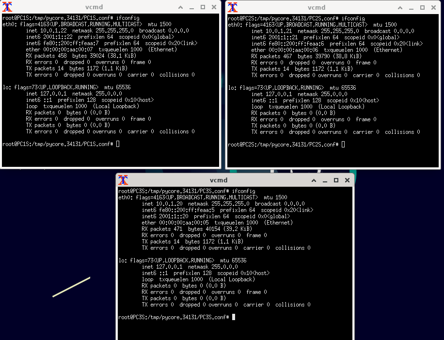
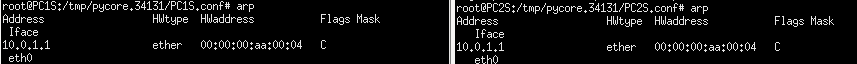
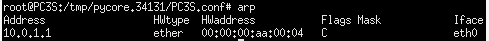
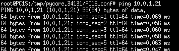
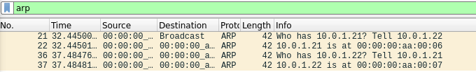
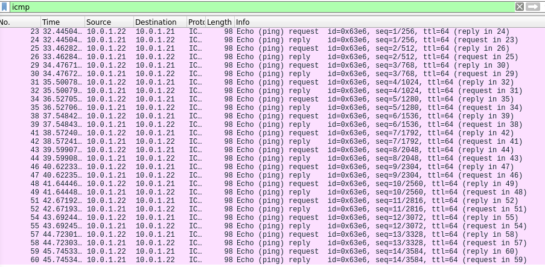
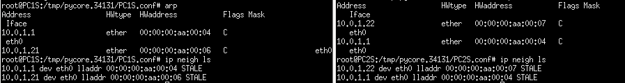
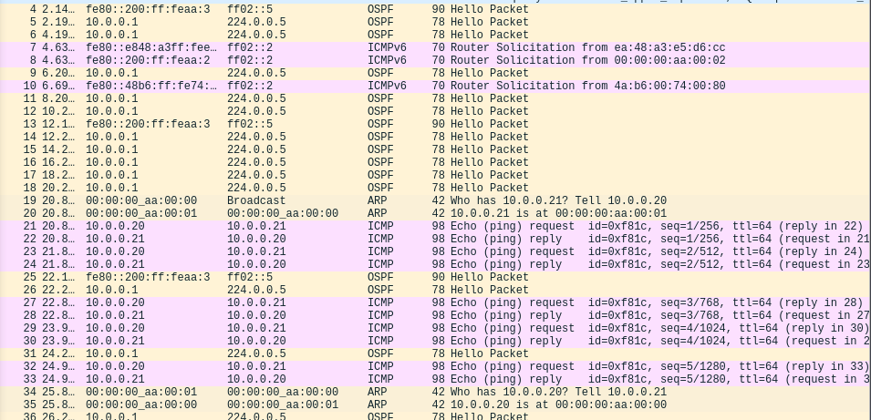
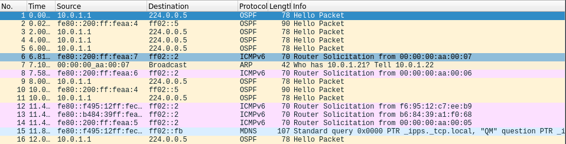

## Práctica 11 - Capa de Enlace - Parte II

### 1. Utilizando la máquina virtual provista por la cátedra, arme una red como la siguiente, con un segmento de LAN usando un HUB y otro segmento de LAN usando un SWITCH.

### a. Antes de empezar el ejercicio ejecute en una terminal el siguiente comando: sudo iptables -P FORWARD ACCEPT

Lo hice en una terminal normal.

### b. Analizar el funcionamiento de ARP

### i. Indique para PC1_SW, PC2_SW y PC3_SW la IP y la dirección MAC de cada una (Ver comandos ip addr o ipconfig).

|      | IP        | MAC        |
| ---- | --------- | ---------- |
| PC1S | 10.0.1.22 | 2001:1::22 |
| PC2S | 10.0.1.21 | 2001:1::21 |
| PC3S | 10.0.1.20 | 2001:1::20 |

### ii. Verifique el contenido de la tabla ARP de cada una de ellas (Ver comando arp o ip neigh).

### iii. Inicie Wireshark en PC2_SW y luego envíe un ping desde la PC1_SW a la PC2_SW. Analice los paquetes ARP e ICMP capturados e indique:

### \* Para ARP: tipo de paquete, direcciones de capa 2 y datos específicos del protocolo.

El paquete tiene los datos: numero de paquete, tiempo que tardo, IP de origen, IP destino (el primero es broadcast), el protocolo (ARP), la longitud del paquete e información extra.

### \* Para ICMP: tipo de paquete, direcciones de capa 2, de capa 3, tipo y código ICMP.

El paquete tiene los datos: numero de paquete, tiempo que tardo, IP de origen, IP destino, el protocolo (ICMP), la longitud del paquete e información extra: los echo request y reply.

### iv. Verifique nuevamente el contenido de la tabla ARP de las PCs ni bien termine de ejecutar el comando ping. ¿Qué entradas aparecen en cada tabla y por qué? ¿Qué estado tienen (ip neigh ls)?

Las tablas de ARP de las PCs 1 y 2 cambió, mientras que la de PC3 sigue igual.

### v. Borre las entradas de las tablas ARP de ambas PC y agregue de forma estática en PC1_SW la entrada que corresponde a PC2_SW y en PC2_SW la que corresponde a PC1_SW. Si hiciera un ping de PC1_SW a PC2_SW, ¿se verían paquetes de ARP? Verifíquelo en la máquina virtual iniciando una captura de tráfico en PC2_SW. ¿Qué estado tienen ahora las entradas ARP? (Comando arp para agregar entradas estáticas en la tabla ARP)

No necesita ejecutar ARP porque ya conoce la dirección MAC del destino. El estado que tienen es Persistente.

### vi. En PC1_SW modifique la entrada ARP que agregó en el punto anterior poniendo una MAC que no exista en la red. Vuelva a intentar hacer el ping. ¿Qué ocurre y por qué?

Enviará la trama pero no será procesada por nadie ya que ningún nodo tiene esa MAC asignada, por lo tanto, todos los nodos la descartarán al recibirla.

### c. Analizar y comparar el funcionamiento de un HUB y de un SWITCH.

### i. Antes de empezar asegúrese que todas las tablas estén vacías. Puede hacerlo deteniendo e iniciando la topología nuevamente.

listo :p

### ii. Inicie Wireshark en PC3_HUB y luego envíe un ping desde la PC1_HUB a PC2_HUB. Analice el origen y destino de cada uno de los paquetes ARP e ICMP capturados. ¿Alguno se origina en o va destinado a PC3_HUB? ¿Por qué observa cada uno de esos paquetes?

No, ningun paquete se origina o va destinado a PC3H. Observa cada paquete porque en un HUB los mensajes se envian a todos los dispositivos conectados (menos el dispositivo que lo envío).

### iii. Inicie Wireshark en PC3_SW y luego envíe un ping desde la PC1_SW a PC2_SW. Analice el origen y destino de cada uno de los paquetes ARP e ICMP capturados. ¿Alguno se origina en o va destinado a PC3_SW? ¿Por qué observa cada uno de esos paquetes?

Ningun paquete se origina en PC3S pero si hay uno destinado a el, ya que el Switch manda un mensaje broadcast a todos los dispositivos cuando no conoce un dispositivo al cual tiene que dirigir directamente un mensaje.

### iv. ¿Qué diferencia observa entre los dos casos anteriores? Explique por qué ocurre así.

La principal diferencia es que el HUB envia siempre un mensaje a todos los dispositivos conectados al HUB; por otro lado, el switch conoce dispositivos, la tabla de dispositivos los genera conociéndolos, si tiene que mandar información de un nodo a otro y no lo conoce o no tiene en su tabla dirección del segundo nodo entonces tiene que enviarlo por broadcast/multicast, es decir, simulando el funcionamiento de un HUB. Si se envía la información y tiene en su tabla la dirección del segundo nodo, entonces sólo ese nodo recibirá esa información puesto que lo conoce y sabe a quién enviársela.

### v. Indique cómo queda la tabla CAM del SWITCH una vez realizado el ping. ¿Cómo se arma y en qué orden?

La tabla CAM se genera conociendo dispositivos (lo expliqué arriba).
No sé cómo ver la tabla de un switch en core xD
