## Práctica 2 - Capa de Aplicación - DNS

## DNS

### 1. Investigue y describa cómo funciona el DNS. ¿Cuál es su objetivo?

DNS sirve para traducir los nombres de host a su direccion IP correspondiente, esto sirve para que cuando queramos comunicarnos con otras terminales no tengamos que buscarlo por su nombre IP, sino simplemente escribimos su mnemónico. DNS es: una base de datos que contiene las IPs de los nombres de host, y también es un protocolo de la capa de aplicación que permite a los hosts consulta su BD. Se ejecuta sobre UDP y utiliza el puerto 53.

### 2. ¿Qué es un root server? ¿Qué es un generic top-level domain (gtld)?

Un root server es aquel que proporciona las direcciones IP de los servidores TLD.  
Un gTLD es una de las categorias de TLD, la cual alberga extensiones globales para los nombres de dominio, suelen aparecer al final de los mismos. Algunos ejemplos son: (.com, .net, .org).

### 3. ¿Qué es una respuesta del tipo autoritativa?

Una respuesta autoritativa sucede cuando una consulta DNS es respondida por el servidor autoritativo que alberga un nombre de dominio. Si la respuesta es emitida por un DNS local, sin este ser parte del servidor autoritativa, entonces es no-autoritativa.

### 4. ¿Qué diferencia una consulta DNS recursiva de una iterativa?

Una consulta recursiva es aquella que envia a un mismo servidor una consulta hasta que la respuesta sea, en efecto, la dirección IP del host que consulto (cuando la obtiene no consulta más). Una consulta recursiva es aquella que puede consultar con varios servidores DNS y recibir respuestas que, quizás, no tengan la dirección IP que requeria, sino que un camino para llegar a ella a traves de los servidores DNS de ella.

### 5. ¿Qué es el resolver?

Un resolver es una parte del sistema operativo que se encarga de realizar las consultas a un servidor DNS, interpretarlas y devolverlas al programa que ha efectuado la consulta. Los servidores DNS también pueden incorporar un resolver, que gestiona las consultas que un servidor DNS debe hacer.
Un resolver suele hacer sólo consultas recursivas.

### 6. Describa para qué se utilizan los siguientes tipos de registros de DNS:

- **A:** Proporciona la respuesta estándar nombre de host-dirección IP. El valor `nombre` es un nombre de un host y `valor` es la dirección IP que le corresponde a dicho nombre. Por ejemplo: (relay.bar.foo.com,145.37.93.126,A) es un registro A.

- **MX:** Permiten a los nombres de host de los servidores de correo tener alias simples. Utilizando este registro, las empresas pueden tener el mismo alias para su servidor de correo que para otros servidores. El `nombre` es un alias y `valor`es el nombre canonico del servidr. Por ejemplo (foo.com, mail.bar.foo.com, MX) es un registro MX.

- **PTR:** Este registro este hace referencia a un punto de terminación de red. Es decir, que la sintaxis de DNS es la responsable del mapeo de una dirección IPv4 para el CNAME en el alojamiento. En otras palabras, es lo contario al registro A ya que A apunta a una IP y PTR resuelve una IP a un nombre de dominio.

- **AAAA:** Es igual a A con la diferencia que contiene la dirección IPv6 de un dominio, en vez de IPv4 que es la version que utiliza A. En este caso, las direcciones IPv6 necesitan de 128 bits, por lo cual el valor rdlenght también será fijo. Por este motivo se denomina AAAA, siendo cuatro veces más larga que A.

- **SRV:** Este registro hace referencia a "Servicio". Se utiliza para la definición de un servicio TCP en el que opera el dominio.

- **NS:** Este registro se utiliza para enrutar las consultas DNS a lo largo de las cadenas de consulta. El `nombre` es un dominio y el `valor` es el nombre de host de un servidor DNS autoritativo que sabe cómo obtener las direcciones IP de los host de dominio. Por ejemplo: (foo.com, dns.foo.com, NS) es un registro NS.

- **CNAME:** Este registro puede proporcionar a los host que hacen consultas el nombre canónico correspondiente a un nombre de host. El `valor` es un nombre de host canónico correspondiente al alias especificado por `nombre`. Por ejemplo: (foo.com, relay1.bar.foo.com) es CNAME.

- **SOA:** Este registro hace referencia al comienzo de autoridad. Este registro es uno de los registros DNS más importantes porque guarda información esencial como la fecha de la última actualización del dominio, otros cambios y actividades. En este tipo de transferencias se copian archivos en otros servidores con la finalidad de evitar fallos. Esto también controla la propagación del archivo original.

- **TXT:** Este registro hace referencia a un texto. Permite que el administrador inserte texto en la consulta DNS. Esto se utiliza para dejar notas sobre la información de dominio.

### 7. En Internet, un dominio suele tener más de un servidor DNS. ¿Por qué cree que esto es así?

Un dominio suele tener más de un servidor DNS para que sea posible acceder a ese sitio lo más rápido posible. Con esto me refiero a que si sólo tuviera un sólo servidor y muchos host quisieran acceder a un dominio entonces se saturaria y el tiempo de respuesta seria muy lento. Así mismo, ocurre la misma situación si un host quiere acceder a un dominio que esta muy alejado geograficamente.

### 8. Cuando un dominio cuenta con más de un servidor, uno de ellos es el primario (o maestro) y todos los demás son los secundarios (o esclavos). ¿Cuál es la razón de que sea así?

La razón de la existencia de ambos servidores es que en conjunto facilitan la administración del espacio de nombres de dominio. Básicamente, el servidor primario mantiene la información autoritativa de un nombre de dominio, obtenido desde su propia configuración. Un servidor DNS secundario copia su configuración desde el primario. Así, si es necesario hacer un cambio a la configuración, se modifica el primario y se espera a que los secundarios "se enteren" paulatinamente del cambio.
En el caso de que el DNS primario deja de responder, la existencia de un secundario ayuda a que el nombre de dominio se siga viendo en Internet. Sin embargo, si el primario está respondiendo, el secundario también recibirá consultas y debe estar actualizado y respondiendo.

### 9. Explique brevemente en qué consiste el mecanismo de transferencia de zona y cuál es su finalidad.

Una transferencia de zona es un tipo de transacción DNS normalmente inducida a través de una consulta tipo “AXFR” para poder replicar bases de datos con registros entre servidores DNS. 
La información contenida en cada transferencia de zona puede entregarnos la información de todos los dominios y/o servidores de cada base de datos de registros en el servidor DNS.. 
La finalidad de transferencia de zona es mantener consistencia entre dos o mas servidores DNS, o sea generar concordancia entre un registro DNS en un servidor primario y servidores secundarios, los cuales se actualizan consultando cambios al servidor primario para así actualizar sus registros propios, de esta manera cualquier cambio realizado en el servidor DNS principal se replica hacia el resto de los servidores.

### 10. Imagine que usted es el administrador del dominio de DNS de la UNLP (unlp.edu.ar). A su vez, cada facultad de la UNLP cuenta con un administrador que gestiona su propio dominio (por ejemplo, en el caso de la Facultad de Informática se trata de info.unlp.edu.ar). Suponga que se crea una nueva facultad, Facultad de Redes, cuyo dominio será redes.unlp.edu.ar, y el administrador le indica que quiere poder manejar su propio dominio. ¿Qué debe hacer usted para que el administrador de la Facultad de Redes pueda gestionar el dominio de forma independiente? (Pista: investigue en qué consiste la delegación de dominios).

Para esto hay que cambiar el servidor al que apunta a uno nuevo y si el mismo es autoritativo hay que gestionar los subdominios.

### 11. Responda y justifique los siguientes ejercicios

### a. En la VM, utilice el comando dig para obtener la dirección IP del host www.redes.unlp.edu.ar y responda:

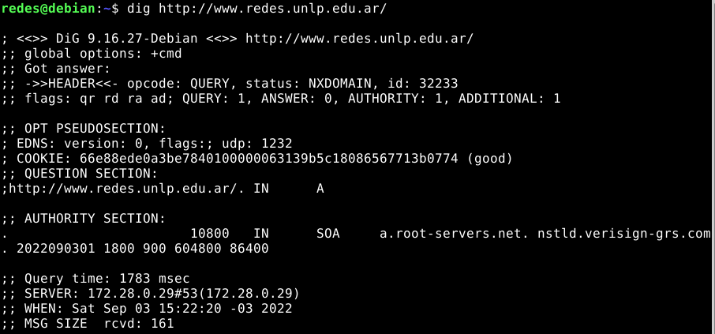

### i. ¿La solicitud fue recursiva? ¿Y la respuesta? ¿Cómo lo sabe?

Esta información se puede apreciar en las flags. Se puede ver que tiene las flags `rd` y `ra` las cuales corresponden a _recursion desired_ y _recursion allowed_ respectivamente. Ambas indican que tanto la solicitud como la respuesta fueron recursivas.

### ii. ¿Puede indicar si se trata de una respuesta autoritativa? ¿Qué significa que lo sea?

No es una respuesta autoritativa ya que no tiene el flag `aa`, el cual informa de que es una respuesta autorizada. Una respuesta es autoritativa si la envia el servidor autoritativo del dominio.

### iii. ¿Cuál es la dirección IP del resolver utilizado? ¿Cómo lo sabe?

La dirección IP de resolver es: `172.28.0.29`.

### b. ¿Cuáles son los servidores de correo del dominio redes.unlp.edu.ar? ¿Por qué hay más de uno y qué significan los números que aparecen entre MX y el nombre? Si se quiere enviar un correo destinado a redes.unlp.edu.ar, ¿a qué servidor se le entregará? ¿En qué situación se le entregará al otro?

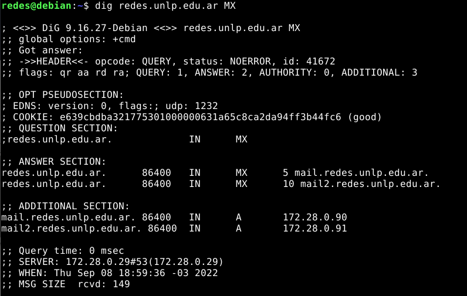

Los servidores de correo del dominio `redes.unlp.edu.ar` son: `mail.redes.unlp.edu.ar` y `mail2.redes.unlp.edu.ar`. Los numeros que aparecen entre MX y el nombre son los numeros de prioridad que se le darán.  
Si se quiere enviar un correo destinado a `redes.unlp.edu.ar` se tratará de entregar a `mail.redes.unlp.edu.ar` ya que es el que mayor prioridad tiene, de no ser posible se entregará a `mail2.redes.unlp.edu.ar`.

### c. ¿Cuáles son los servidores de DNS del dominio redes.unlp.edu.ar?

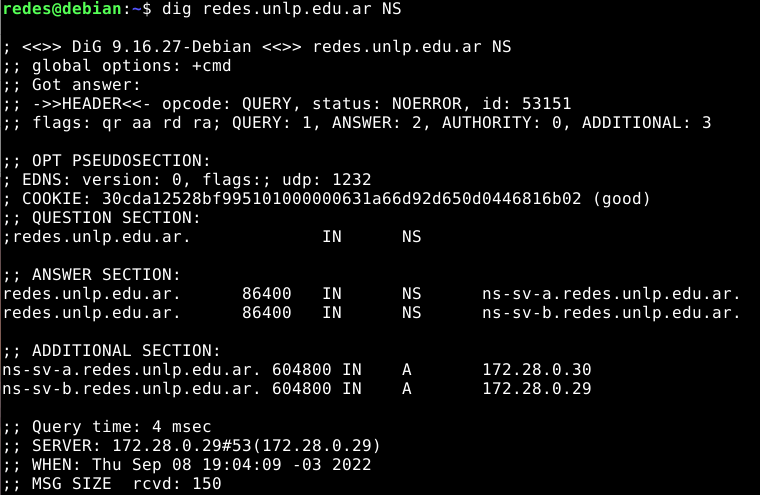

Los servidores de DNS de `redes.unlp.edu.ar` son `ns-sv-a.redes.unlp.edu.ar` y `ns-sv-b.redes.unlp.edu.ar`

### d. Repita la consulta anterior cuatro veces más. ¿Qué observa? ¿Puede explicar a qué se debe?

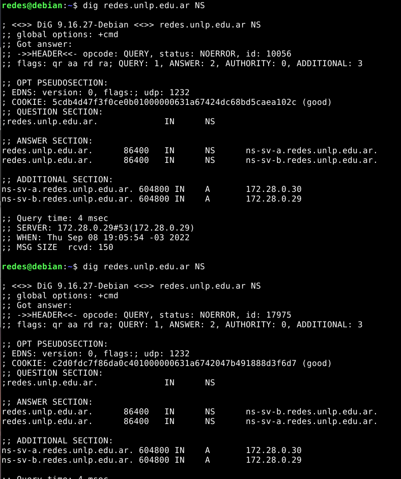

Se puede observar que cambio:

- La Id de la consulta, el cliente crea una Id para cada consulta y debido a esto cambia.
- La cookie, las cookies están encriptadas para proteger los servidores DNS, por lo que es probable que el encriptado cambie en cada consulta.
- El valor de When, esto indica la fecha y hora de la consulta asi que es logico que cambie debido a la diferencia de segundos entre consultas.

### e. Observe la información que obtuvo al consultar por los servidores de DNS del dominio. En base a la salida, ¿es posible indicar cuál de ellos es el primario?

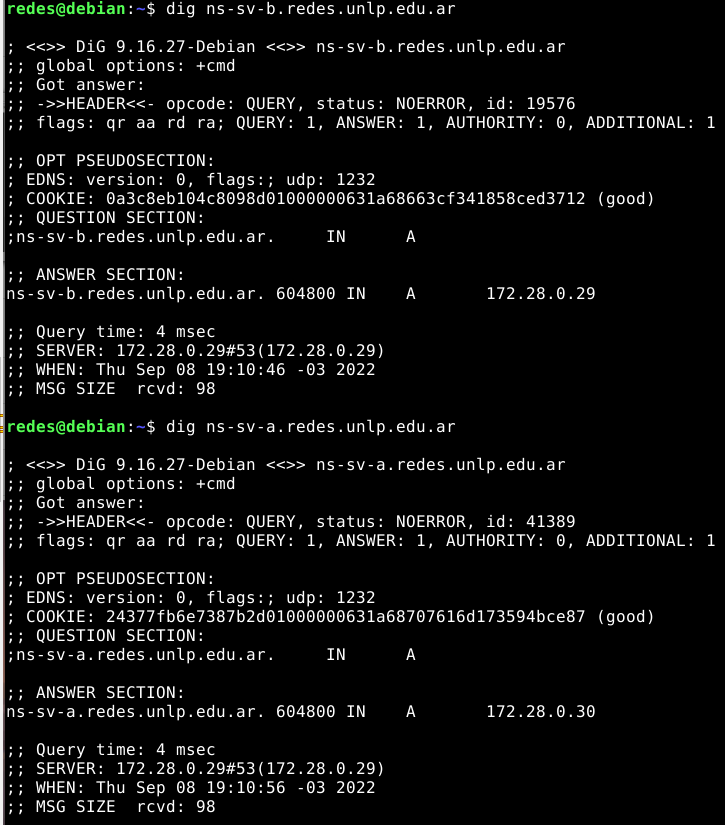

Si se consulta por los cada uno de los servidores se puede observar que varía la IP de cada uno, sin embargo no sé si es información suficiente para saber si es primario o no.

### f. Consulte por el registro SOA del dominio y responda.

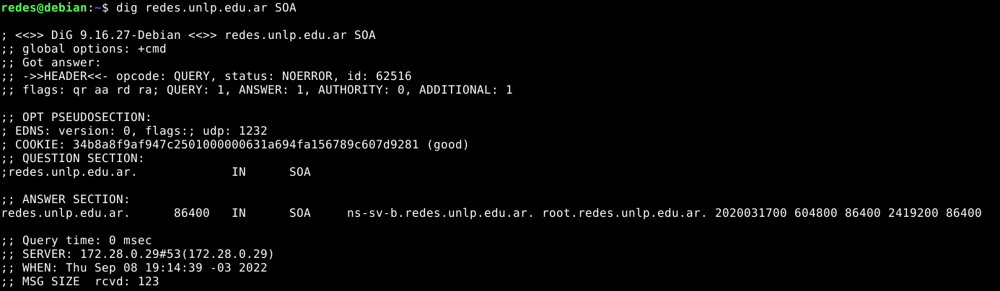

### i. ¿Puede ahora determinar cuál es el servidor de DNS primario?

Si, se puede determinar que el servidor primario es `ns-sv-b.redes.unlp.edu.ar`.

### ii. ¿Cuál es el número de serie, qué convención sigue y en qué casos es importante actualizarlo?

El número de serie aumenta con cada actualización del archivo. Existen dos maneras de hacerlo. Por un lado, se empieza por 1 y se suma en uno cada vez que hay una actualizacion. Esta opción permite saber, a partir del número de serie, cuántos cambios ha habido.  

La segunda opción es usar formato de fecha: AAAA-MM-DD-VV. Se empieza con un año, luego el mes y el día y por último un número de versión, todos de dos cifras menos el año. Este formato permite saber en qué fecha se creó la versión. Con cada cambio en un mismo día, el número de versión aumenta en una cifra. Al día siguiente cambia el número de serie y el número de versión vuelve a ponerse a 00.

El número de serie es `2020031700`, por lo que podemos deducir que utiliza la convención de fecha y si lo desglosamos seria: 2020 - 03 - 17 - 00 --> 17 de marzo de 2020 versión 0.

### iii. ¿Qué valor tiene el segundo campo del registro? Investigue para qué se usa y como se interpreta el valor.

El segundo campo del registro es TTL. El valor TTL actual de un registro determina cuánto tardará en aplicarse cualquier cambio que realices.

### iv. ¿Qué valor tiene el TTL de caché negativa y qué significa?

El valor TTL de caché negativa es `86400` e indica durante cuánto tiempo el cliente puede guardar la información solicitada en la memoria caché antes de que sea necesario enviar una nueva solicitud.

### g. Indique qué valor tiene el registro TXT para el nombre saludo.redes.unlp.edu.ar. Investigue para qué es usado este registro.

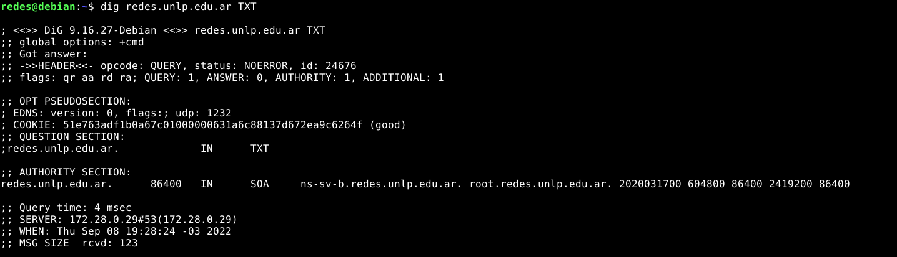

El TXT permite que el administrador inserte notaciones en el server root.

### h. Utilizando dig, solicite la transferencia de zona de redes.unlp.edu.ar, analice la salida y responda.

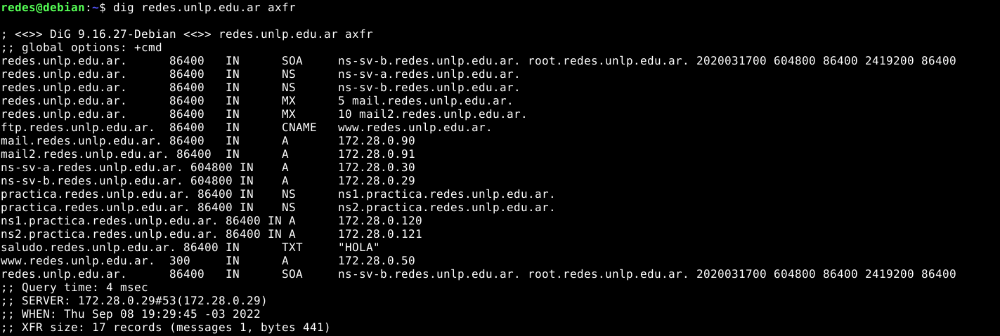

### i. ¿Qué significan los números que aparecen antes de la palabra IN? ¿Cuál es su finalidad?

Los números que aparecen antes de la palabra IN es el TTL.

### ii. ¿Cuántos registros NS observa? Compare la respuesta con los servidores de DNS del dominio redes.unlp.edu.ar que dio anteriormente. ¿Puede explicar a qué se debe la diferencia y qué significa?

Observo 4 registros NS. La diferencia con la consulta a NS ya hecha es que esos registros DNS son del subdominio `practica.redes.unlp.edu.ar`.

### i. Consulte por el registro A de www.redes.unlp.edu.ar y luego por el registro A de www.practica.redes.unlp.edu.ar. Observe los TTL de ambos. Repita la operación y compare el valor de los TTL de cada uno respecto de la respuesta anterior. ¿Puede explicar qué está ocurriendo? (Pista: observar los flags será de ayuda).

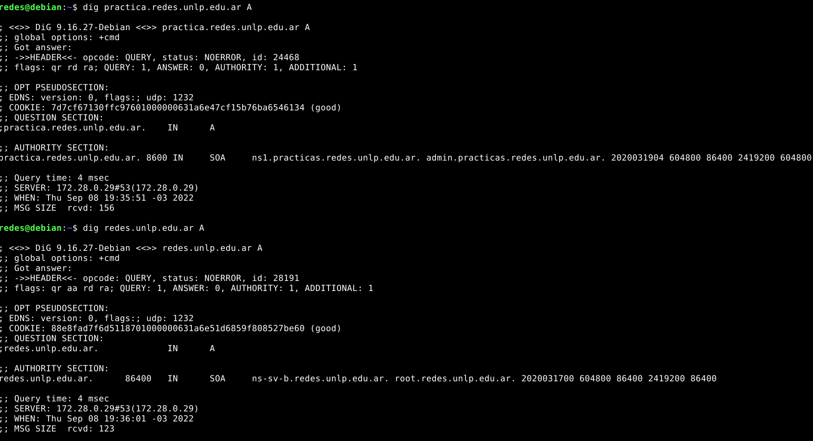

El TTL de `www.practica.redes.unlp.edu.ar` es menor.

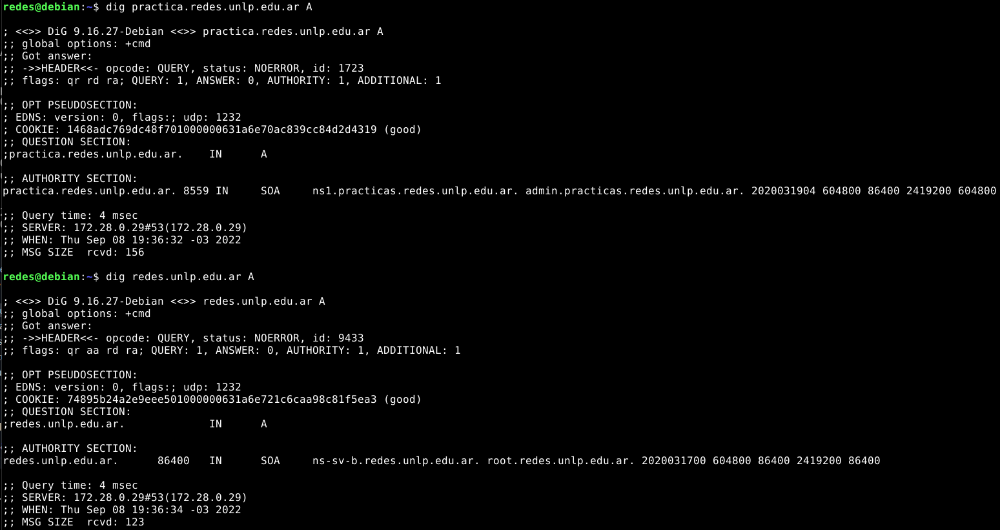

Si repito la operación el TLL de `www.practica.redes.unlp.edu.ar` disminuye, en cambio el TTL de `www.redes.unlp.edu.ar` se mantiene estable. Esto ocurre debido a que `www.redes.unlp.edu.ar` viene de un servidor autoritativo (flag `aa`) por lo que no debe actualizar su información.

### j. Consulte por el registro A de www.practica2.redes.unlp.edu.ar. ¿Obtuvo alguna respuesta? Investigue sobre los codigos de respuesta de DNS. ¿Para qué son utilizados los mensajes NXDOMAIN y NOERROR?

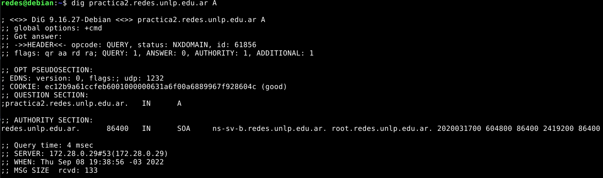

Se obtiene una respuesta con el estado `NXDOMAIN` lo cual significa que el registro no existe.  
Por otro lado, el mensaje `NOERROR` indica que no hubo errores para realizar la consulta y que se obtuvo una respuesta válida.

### 12. Investigue los comando nslookup y host. ¿Para qué sirven? Intente con ambos comandos obtener:

Nslookup es un programa utilizado para saber si el DNS está resolviendo correctamente los nombres y las IPs. Se utiliza con el comando `nslookup`, que funciona tanto en Windows como en UNIX para obtener la dirección IP conociendo el nombre, y viceversa.  
El comando `host` se usa para encontrar la dirección IP del dominio dado y también muestra el nombre de dominio para la IP dada.

### - Dirección IP de www.redes.unlp.edu.ar.

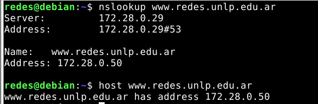

### - Servidores de correo del dominio redes.unlp.edu.ar.

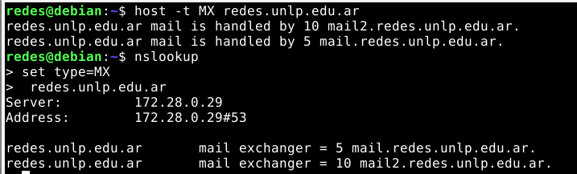

### - Servidores de DNS del dominio redes.unlp.edu.ar.

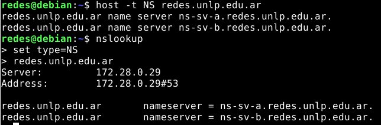

### 13. ¿Qué función cumple en Linux/Unix el archivo /etc/hosts o en Windows el archivo \WINDOWS\system32\drivers\etc\hosts?

El archivo hosts de un ordenador se usa por el sistema operativo para guardar la correspondencia entre dominios de Internet y direcciones IP. Este es uno de los diferentes métodos que usa el sistema operativo para resolver nombres de dominio. Antiguamente, cuando no había servidores DNS que resolvieran los dominios, el archivo hosts era el único encargado de hacerlo.

### 14. Abra el programa Wireshark para comenzar a capturar el tráfico de red en la interfaz con IP 172.28.0.1. Una vez abierto realice una consulta DNS con el comando dig para averiguar el registro MX de redes.unlp.edu.ar y luego, otra para averiguar los registros NS correspondientes al dominio redes.unlp.edu.ar. Analice la información proporcionada por dig y compárelo con la captura.

Al hacer la consulta MX en la captura se puede observar la siguiente información:

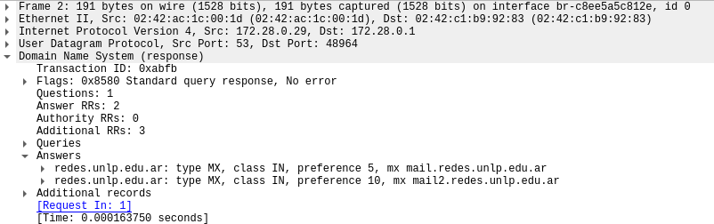

Y en el dig:

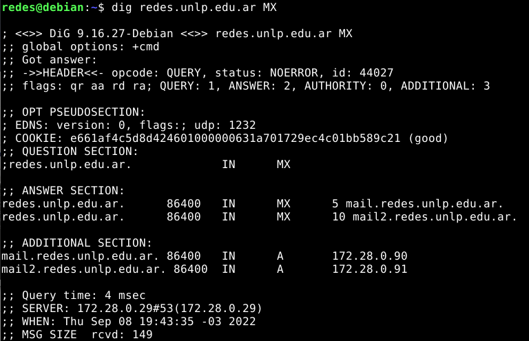

Al hacer la consulta NS en la captura se puede observar la siguiente información:

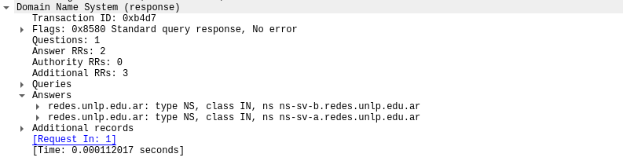

Y en el dig:

### 15. Dada la siguiente situación: “Una PC en una red determinada, con acceso a Internet, utiliza los servicios de DNS de un servidor de la red”. Analice:

### a. ¿Qué tipo de consultas (iterativas o recursivas) realiza la PC a su servidor de DNS?

La PC realiza consultas recursivas al servidor DNS, por lo cual este le responderá al resolver ya sea con la respuesta esperada o con un error. Si en cambio la consulta fuese iterativa, el servidor DNS responderá de la mejor manera posible para que el cliente pueda seguir buscando.

### b. ¿Qué tipo de consultas (iterativas o recursivas) realiza el servidor de DNS para resolver requerimientos de usuario como el anterior? ¿A quién le realiza estas consultas?

El servidor DNS que intenta resolver la consulta recursiva, realizará una serie de consultas iterativas a los distintos servidores DNS que sean necesarios hasta llegar al servidor DNS autoritativo para el dominio solicitado.

### 16. Relacione DNS con HTTP. ¿Se puede navegar si no hay servicio de DNS?

HTTP permite comunicar dos o más terminales para que compartan recursos. Para esto, los host deben identificarse de manera única y para eso se utilizan las IP. DNS permite mapear direcciones IP a partir de un nombre de dominio sin la necesidad que los usuarios se acuerdan las direcciones IP de todos los dominios. Por lo que, sin servicio DNS, la búsqueda sería mucho más dificil y tediosa, sin dejar de mencionar lo lento que sería tambien; todo esto es debido a que, como no se puede buscar por un nombre facilmente reconocible y que DNS se ocupe de toda la lógica, los usuarios deberian conocer el IP del host con el que se quieren conectar, los recursos se referenciarian mediante las IP y además las IP deberían ser estaticas.

### 17. Observar el siguiente gráfico y contestar:

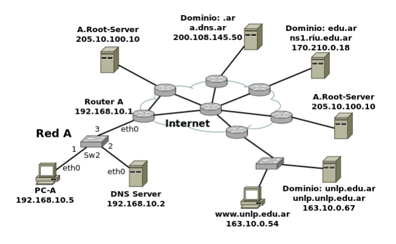

### a. Si la PC-A, que usa como servidor de DNS a "DNS Server", desea obtener la IP de www.unlp.edu.ar, cuáles serían, y en qué orden, los pasos que se ejecutarán para obtener la respuesta.

// consultar: los switch cuentan como comunicacion o solo son intermediarios?

1. PC-A hace una consulta a DNS Server `192.168.10.2` por el dominio www.unlp.edu.ar
2. DNS Server `192.168.10.2` hace una consulta a A.Root-Server
3. A.Root-Server el responde a DNS Server `192.168.10.2` con los TDL de `.ar`
4. DNS Server `192.168.10.2` consulta a a.dns.ar
5. a.dns.ar le responde con el TDL de edu.ar
6. DNS Server `192.168.10.2` hace una consulta a ns1.riu.edu.ar
7. ns1.riu.edu.ar le responde con el dominio unlp.edu.ar
8. DNS Server `192.168.10.2` hace una consulta a unlp.edu.ar
9. unlp.edu.ar le responde con el IP de www.unlp.edu.ar
10. DNS Server `192.168.10.2` le envia a PC-A el IP de www.unlp.edu.ar

### b. ¿Dónde es recursiva la consulta? ¿Y dónde iterativa?

De PC-A a DNS Server la consulta es recursiva, mientras que todas las consultas de DNS Server son iterativas.

### 18. ¿A quién debería consultar para que la respuesta sobre www.google.com sea autoritativa?

Para que la respuesta sea autoritativa hay que hacer la consulta a un servidor autoritativo del dominio `www.google.com`, dicho servidor podemos obtenerlo consultando por los registros NS.

- Obtenemos el servidor:

  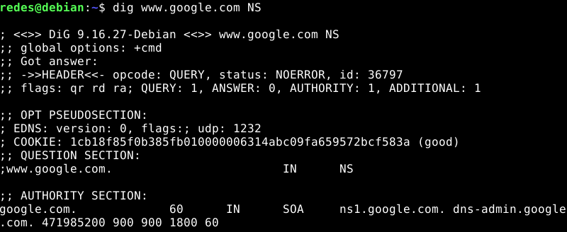

- Consultamos a ese servidor:

  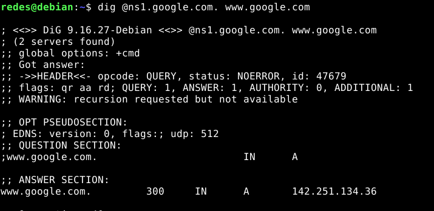

### 19. ¿Qué sucede si al servidor elegido en el paso anterior se lo consulta por www.info.unlp.edu.ar? ¿Y si la consulta es al servidor 8.8.8.8?

Si al servidor le consulto por `www.info.unlp.edu.ar` no obtengo respuesta ya que dicho servidor no tiene en sus registros el IP de la URL consultada.

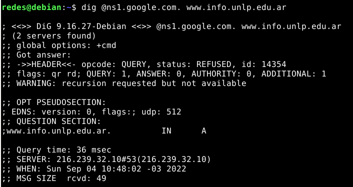

En cambio, si le consulto al servidor `8.8.8.8` si obtengo respuesta.

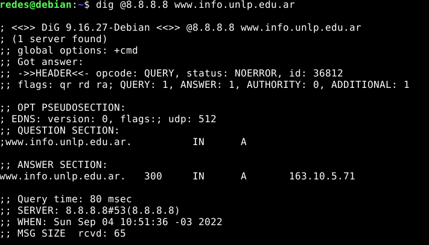
