## Práctica 4 - Capa de Aplicación- Correo electrónico

## Correo electrónico

### 1. ¿Qué protocolos se utilizan para el envío de mails entre el cliente y su servidor de correo? ¿Y entre servidores de correo?

Los protocolos que se utilizan para el envío de mails entre cliente y su servidor de correo es SMTP utilizando TCP, al igual que para comunicarse entre servidores de correo. Esto es gracias a que SMTP tiene dos lados: el lado del cliente, que se ejecuta en el servidor de
correo del emisor, y el lado del servidor, que se ejecuta en el servidor de correo del destinatario.  
Tanto el lado del cliente como el del servidor de SMTP se ejecutan en todos los servidores de correo.  
Cuando un servidor de correo envía mensajes de correo a otros servidores de correo, actúa como
un cliente SMTP. Cuando un servidor de correo recibe correo de otros servidores, actúa como un
servidor SMTP.

### 2. ¿Qué protocolos se utilizan para la recepción de mails? Enumere y explique características y diferencias entre las alternativas posibles.

Para la recepción de mails podemos encontrar dos protocolos:

- <b>POP3:</b> Es un protocolo bastante simple, debido a esto su funcionabilidad es muy limitada. POP3 se inicia cuando el agente de usuario (el cliente) abre una conexión TCP en
  el puerto 110 al servidor de correo (el servidor). Una vez establecida la conexión TCP, POP3 pasa
  a través de tres fases: 
  _ Autorización: el agente de usuario envía un nombre de usuario y una contraseña (en texto legible) para autenticar al usuario.  
  _ Transacción: el agente de usuario recupera los mensajes; también durante esta fase, el agente de usuario puede marcar los mensajes para borrado, eliminar las marcas de borrado y obtener estadísticas de correo.  
  \_ Actualización: tiene lugar después que el cliente haya ejecutado el comando quit, terminando la sesión POP3; en este instante, el servidor de correo borra los mensajes que han sido marcados para borrado. 
  En una transacción POP3, el agente de usuario ejecuta comandos y el servidor devuelve para
  cada comando una respuesta (`+OK`y `-ERR`).
- <b>IMAP:</b> Al igual que POP3, IMAP es un protocolo de acceso a correo. Ofrece muchas más funcionalidades que POP3, pero también es significativamente más complejo (y, por tanto, las implementaciones del lado del cliente y del lado del servidor son bastante más complejas).  
  Un servidor IMAP asociará cada mensaje con una carpeta; cuando un mensaje llega al servidor,
  se asocia con la carpeta INBOX (Bandeja de entrada) del destinatario, el cual puede entonces pasar
  el mensaje a una nueva carpeta creada por el usuario, leer el mensaje, borrarlo, etc. El protocolo
  IMAP proporciona comandos que permiten a los usuarios crear carpetas y mover los mensajes
  de una carpeta a otra. IMAP también proporciona comandos que permiten a los usuarios realizar
  búsquedas en carpetas remotas para localizar mensajes que cumplan unos determinados criterios. A diferencia de POP3, un servidor IMAP mantiene información acerca del estado a lo largo de las sesiones IMAP, como por ejemplo, los nombres de las carpetas y los mensajes asociados
  con cada una de ellas.
- <b>HTTP</b>: el agente de usuario es un navegador web corriente y el usuario se comunica con su buzón remoto a través de HTTP. Cuando un destinatario desea acceder a un mensaje de su buzón, este es enviado desde su servidor de correo al navegador utilizando el protocolo HTTP en lugar de los protocolos POP3 o IMAP. Cuando un emisor desea enviar un mensaje de correo electrónico, este es
  transmitido desde su navegador a su servidor de correo a través de HTTP en lugar de mediante
  SMTP. Sin embargo, el servidor de correo del emisor, continúa enviando mensajes a, y recibiendo
  mensajes de, otros servidores de correo que emplean SMTP.

### 3. b. Análisis del protocolo SMTP

### i. Utilizando Wireshark, capture el tráfico de red contra el servidor de correo mientras desde la cuenta alumnopop@redes.unlp.edu.ar envía un correo a alumnoimap@redes.unlp.edu.ar

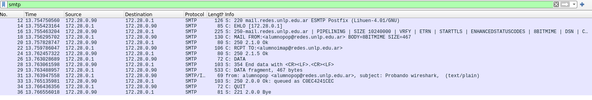

### ii. Utilice el filtro SMTP para observar los paquetes del protocolo SMTP en la captura generada y analice el intercambio de dicho protocolo entre el cliente y el servidor para observar los distintos comandos utilizados y su correspondiente respuesta. Ayuda: filtre por protocolo SMTP y sobre alguna de las líneas del intercambio haga click derecho y seleccione Follow TCP Stream...

En la captura podemos observar la comunicación entre el servidor SMTP (azul) y el cliente SMTP (rojo). Mientras el servidor envia mensajes con códigos de respuesta, el cliente indica comandos como EHLO (su forma de decir hola), MAIL FROM, RCPT TO, DATA y QUIT.

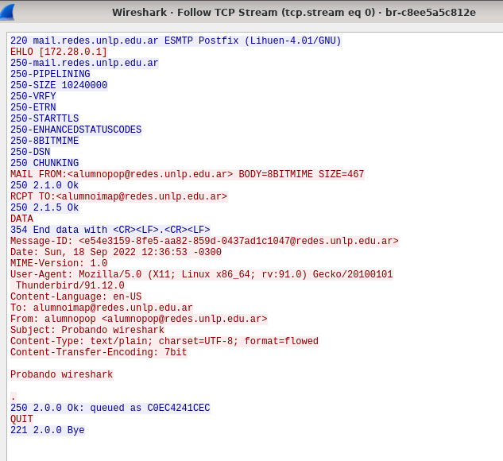

### c. Usando el cliente de correo, thunderbird del usuario alumnopop@redes.unlp.edu.ar envíe un correo electrónico alumnoimap@redes.unlp.edu.ar el cual debe tener: un asunto, datos en el body y una imagen adjunta.

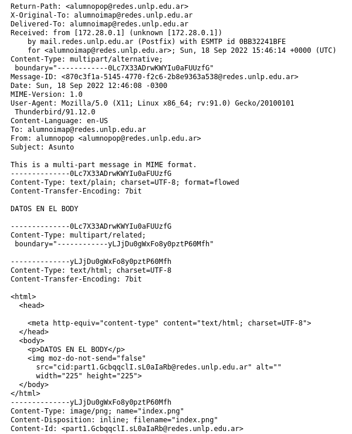

### i. Verifique los fuentes del correo recibido para entender como se utiliza el header “Content-Type: multipart/mixed“ para poder realizar el envío de distintos archivos adjuntos.

Las notas de texto Internet estándar constan de una cabecera general y un cuerpo de texto. Sin embargo, las notas MIME (Multipurpose Internet Mail Extensions) pueden contener múltiples partes, que permiten incluir archivos multimedia adjuntos con el texto. 
Si la cabecera general contiene un tipo de contenido Multipart/Mixed, significa que tiene uno o más archivos adjuntos. Cada archivo adjunto tiene límites de principio y fin. El identificador de límite se establece en el parámetro boundary=, situado a continuación del código de cabecera Content-Type.

### ii. Extraiga la imagen adjunta del mismo modo que lo hace el cliente de correo a partir de los fuentes del mensaje.

(Acá me copie lo que hizo joacko porque no entendí particularmente qué hay que hacer).
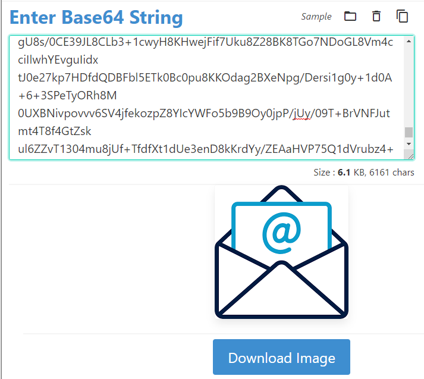

### 4. Análisis del protocolo POP

### a. Utilizando Wireshark, capture el tráfico de red contra el servidor de correo mientras desde la cuenta alumnoimap@redes.unlp.edu.ar le envía una correo a alumnopop@redes.unlp.edu.ar y mientras alumnopop@redes.unlp.edu.ar recepciona dicho correo.

_Envio_:

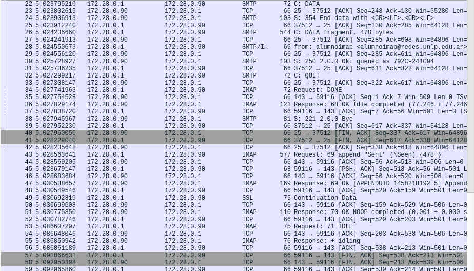

_Recepcion_:

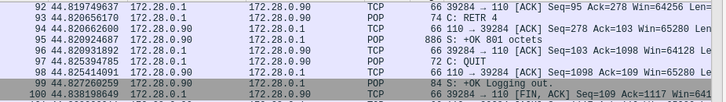

### b. Utilice el filtro POP para observar los paquetes del protocolo POP en la captura generada y analice el intercambio de dicho protocolo entre el cliente y el servidor para observar los distintos comandos utilizados y su correspondiente respuesta.

En la captura podemos observar el lado del cliente (rojo) y del servidor (azul). Podemos observar además que comienza inicializando una conexión con el servidor y luego se autentica (`AUTH PLAIN`). Luego utiliza los comandos: `STAT` (información del buzón, podemos observar que el mensaje consiste en un mensaje positivo el número de mensajes en el buzón y el tamaño del buzón en octetos), `LIST` (información de cada mensaje con su tamaño), `UIDL` (muestra los mensajes con su ID), `RETR 4` (muestra el mensaje correspondiente al número de mensaje dado) y finalmente para cerrar la conexión, `QUIT`.

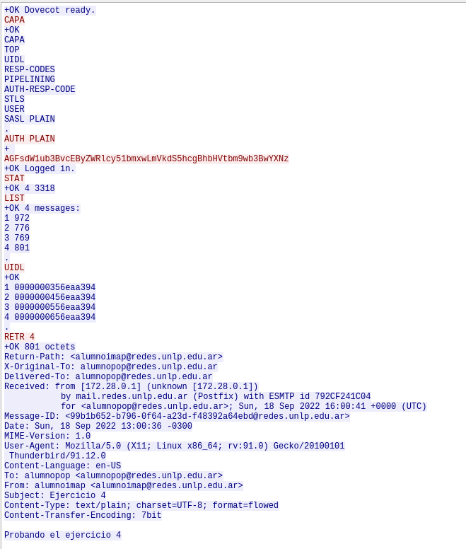

### 5. Análisis del protocolo IMAP

### a. Utilizando Wireshark, capture el tráfico de red contra el servidor de correo mientras desde la cuenta alumnopop@redes.unlp.edu.ar le envía una correo a alumnoimap@redes.unlp.edu.ar y mientras alumnoimap@redes.unlp.edu.ar recepciona dicho correo.

_Envio_:
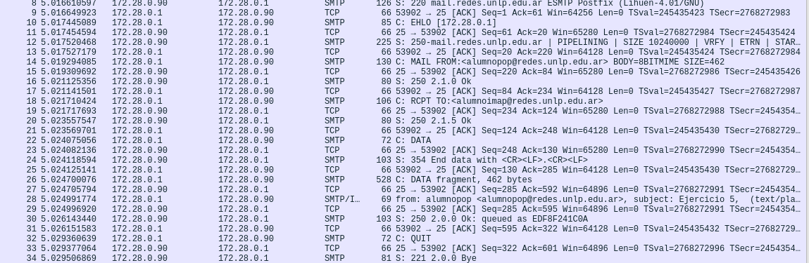

_Recepcion_:
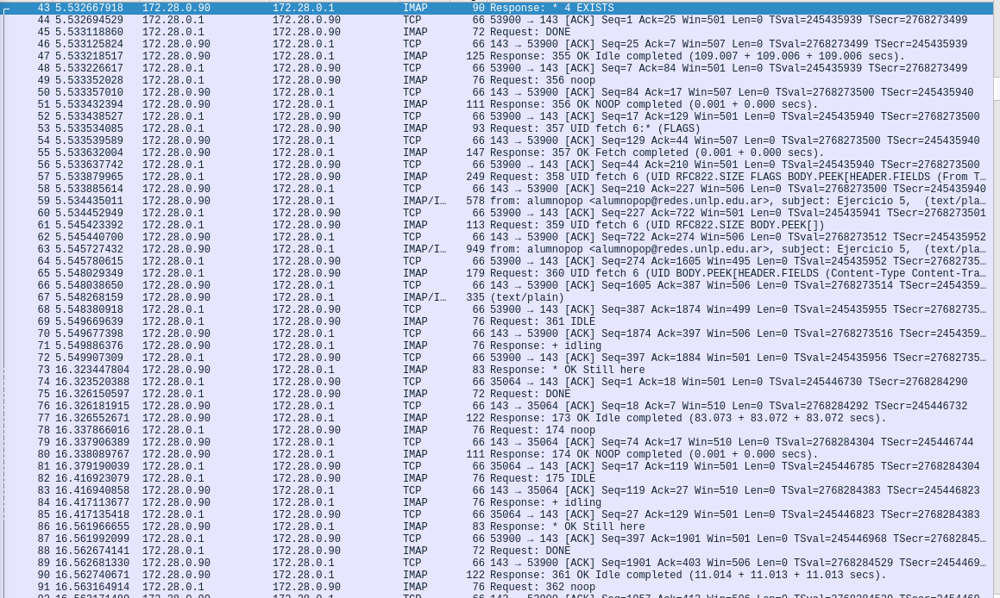

### b. Utilice el filtro IMAP para observar los paquetes del protocolo IMAP en la captura generada y analice el intercambio de dicho protocolo entre el cliente y el servidor para observar los distintos comandos utilizados y su correspondiente respuesta.

En la captura podemos observar el lado del cliente (azul) y del servidor (rojo). Algunos de los comandos que utiliza son: `UID`, `noop`, `IDLE`, `CHECK`.

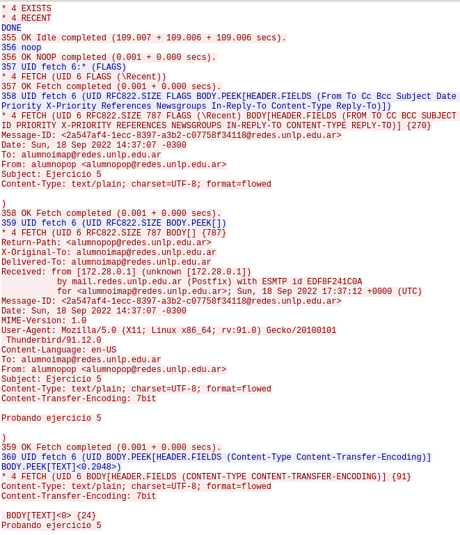
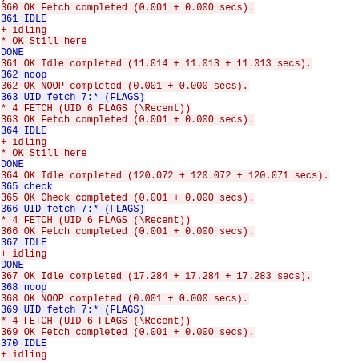

### 6. IMAP vs POP

### a. Marque como leídos todos los correos que tenga en el buzón de entrada de alumnopop y de alumnoimap. Luego, cree una carpeta llamada POP en la cuenta de alumnopop y una llamada IMAP en la cuenta de alumnoimap. Asegurese que tiene mails en el inbox y en la carpeta recientemente creada en cada una de las cuentas.

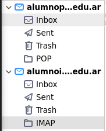

### b. Cierre la sesión iniciada e ingrese nuevamente identificandose como usuario root y password packer, ejecute el cliente de correos. De esta forma, iniciará el cliente de correo con el perfil del superusuario (diferente del usuario con el que ya configuró las cuentas antes mencionadas). Luego configure las cuentas POP e IMAP de los usuarios alumnopop y alumnoimap como se describió anteriormente pero desde el cliente de correos ejecutado con el usuario root. Luego responda:

### i. ¿Qué correos ve en el buzón de entrada de ambas cuentas? ¿Están marcados como leídos o como no leídos? ¿Por qué?

En la cuenta de `alumnopop`se puede observar que los mensajes se encuentran sin leer, esto es debido a que POP3 no conserva el estado del servidor. Por otro lado, en la cuenta `alumnoimap` se muestra la casilla de mensajes como se encontraba en el anterior usuario, es decir que los mensajes se encuentran leídos.

### ii. ¿Qué pasó con las carpetas POP e IMAP que creó en el paso anterior?

Nuevamente la carpeta POP de `alumnopop` desapareció y los mensajes que estaban dentro se encuentran ahora en _Inbox_, mientras que IMAP de `alumnoimap` se encuentra creada y con los mensajes correspondientes.

### c. En base a lo observado. ¿Qué protocolo le parece mejor? ¿POP o IMAP? ¿Por qué? ¿Qué protocolo considera que utiliza más recursos del servidor? ¿Por qué?

Considero que IMAP es un protocolo mejor debido a que conserva el estado del servidor, a diferencia de POP que los guarda de manera local y no en el servidor. El poder de IMAP de conservar el estado, si bien utiliza más recursos del servidor, permite tener sincronizadas las casillas de correo sin importar el dispositivo que se este utilizando.

### 7. ¿En algún caso es posible enviar más de un correo durante una misma conexión tcp? Considere:

### \* Destinatarios múltiples del mismo dominio entre MUA-MSA y entre MTA-MTA

### \* Destinatarios múltiples de diferentes dominios entre MUA-MSA y entre MTA-MTA

Considero que se puede enviar más de un correo mientras no cierre la conexión. (CONSULTAR MAÑANA)

### 8. Indique sí es posible que el MSA escuche en un puerto TCP diferente a los convencionales y qué implicancias tendría.

Es posible pero habría que redirigir los mensajes. (CONSULTAR MAÑANA)

### 9. Indique sí es posible que el MTA escuche en un puerto TCP diferente a los convencionales y qué implicancias tendría.

(CONSULTAR MAÑANA)

### 10. Ejercicio integrador HTTP, DNS y MAIL.

(Es larguisimo así que lo dejo para practicar para el parcial).

### 11. Utilizando la herramienta Swaks envíe un correo electrónico con las siguientes características:

### Dirección destino: Dirección de correo de alumnoimap@redes.unlp.edu.ar

### Dirección origen: redesycomunicaciones@redes.unlp.edu.ar

### Asunto: SMTP-Práctica4

### Archivo adjunto: PDF del enunciado de la práctica

### Cuerpo del mensaje: Esto es una prueba del protocolo SMTP

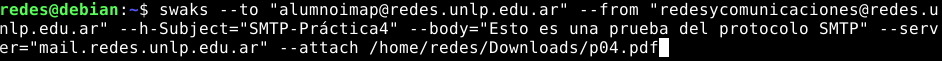

### a. Analice tanto la salida del comando swaks como los fuentes del mensaje recibido para responder las siguientes preguntas:

### i. ¿A qué corresponde la información enviada por el servidor destino como respuesta al comando EHLO? Elija dos de las opciones del listado e investigue la funcionalidad de la misma.

El comando `EHLO` sirve para abrir una sesión con el servidor. Se le agrega un argumento con el nombre del ordenador (debian). Si el servidor soporta ESMTP entonces devuelve una lista de los comandos que soporta esta extension, algunos son: (PERDON JOACKO ACÁ ME COPIE DE VOS PORQUE ME DIO PAJA BUSCAR)

- `STARTTLS`: le indica al servidor que el cliente quiere iniciar una transferencia en modo seguro, a través del protocolo TLS. Si el servidor lo acepta, el protocolo va a volver a su estado inicial, por lo que el cliente va a tener que iniciar la sesión de nuevo con el comando HELO/EHLO.

- `PIPELINING`: le indica al servidor que la conexión con el clienteva a realizarse en modo Pipelining. Esto significa que el cliente va a poder enviar varios mensajes seguidos al servidor sin esperar la respuesta de los anteriores.

### ii. Indicar cuáles cabeceras fueron agregadas por la herramienta swaks.

- `Subject`: este lo añadimos en el comando para enviar el correo, con la opción `--h-Subject`.
- `X-Mailer`: es usado para indicar qué herramienta se utilizó para enviar el correo. En este caso, lo agregó indicando que el mail se envió a través del comando swaks.
- `Content-Type`: este se agregó porque adjuntamos un archivo, por lo que indica que que el mail es multipartes, con contenido variado; también define el divisor del MIME.

### iii. ¿Cuál es el message-id del correo enviado? ¿Quién asigna dicho valor?

El Message-Id es: 20220918161844.006600@debian

### iv. ¿Cuál es el software utilizado como servidor de correo electrónico?

El software utilizado es Postfix. Esto lo vemos en el apartado "by" del header Received de la fuente del mensaje recibido, en el que aparece el servidor que recibió el mail (mail.redes.unlp.edu.ar) y entre paréntesis el Software.

### v. Adjunte la salida del comando swaks y los fuentes del correo electrónico.

_Salida del comando:_

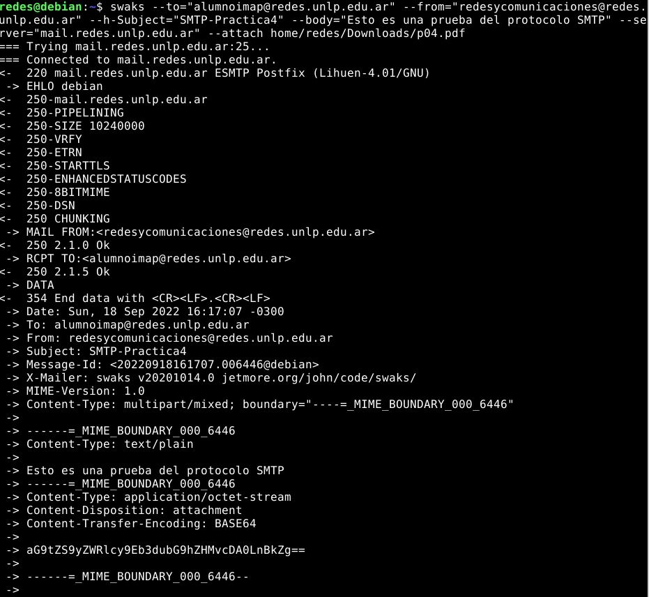

_Fuentes del correo:_
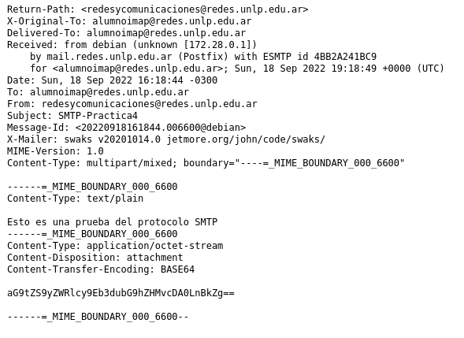

### b. Descargue de la plataforma la captura de tráfico smtp.pcangylasalida del comando swaks smtp.swaks para responder y justificar los siguientes ejercicios.

### i. ¿Por qué el contenido del mail no puede ser leido en la captura de tráfico?

### 12. a. El servidor de mail, mail1, y de HTTP, www, de example.com tienen la misma IP, ¿es posible esto? Si lo es, ¿cómo lo resolvería?

Si, es posible debido a que usan puertos diferentes más allá de su IP.

### b. Al enviar el mail, ¿por qué registro de DNS consultará el MUA?

Consultará por el registro MX, el cual es `smtp-5`.

### c. Una vez que el mail fue recibido por el servidor smtp-5, ¿por qué registro de DNS consultará?

Consultará al root server para obtener la IP de `.com`.

### d. Si en el punto anterior smtp-5 recibiese un listado de nombres de servidores de correo, ¿será necesario realizar una consulta de DNS adicional? Si es afirmativo, ¿por qué tipo de registro y de cuál servidor preguntaría?

Preguntaria por el que tiene más prioridad.

### e. Indicar todo el proceso que deberá realizar el servidor ns1 de misitio.com.ar para obtener los servidores de mail de example.com

- Primero ns1 consultará root usando A para obtener la IP de gtld (.com)
- Al gtld le pregunta por el registro A para obtener la IP de example.com
- Le pregunta a mail1 por el MX para poder enviarlo

### f. Teniendo en cuenta el proceso de encapsulación/desencapsulación y definición de protocolos, responder V o F y justificar:

- ?
- Verdadero
- Falso
- Falso
- Falso

### g. Un cliente web que desea acceder al servidor www.example.com y que no pertenece a ninguno de estos dos dominios puede usar a ns1 de misitio.com.ar como servidor de DNS para resolver la consulta

Falso.

### h. Cuando Alicia quiera ver sus mails desde PC-D, ¿qué registro de DNS deberá consultarse?

### i. Indicar todos los protocolos de mail involucrados, puerto y si usan TCP o UDP, en el envío y recepción de dicho mail
