## Práctica 5 - Capa de Transporte - Parte I

### 1. ¿Cuál es la función de la capa de transporte?

La función de la capa de transporte es conectar procesos de la capa de aplicación. Tiene dos posibles modelos, acompañados del protocolo de internet (IP), UDP y TCP. Siendo UDP el menos confiable ya que trabaja bajo el mismo lema de _best effort_ que IP, por lo tanto no tiene un sistema muy complejo de detección y control de errores, el cual TCP si tiene, además de control de flujo y de congestión.

### 2. Describa la estructura del segmento TCP y UDP.

La estructura de UDP consta de una cabecera y de los datos de la aplicación. Las cabeceras son:

- _Número de puerto de origen_ y _número de puerto de destino_: Los numeros de puerto permiten al host de destino pasar los datos de la aplicación al proceso apropiado que está ejecutandose en el sistema terminal de destino.
- _Longitud_: especifica el numero de bytes del segmento (cabecera + datos)
- _Suma de comprobación_: se utiliza para evaluar posibles errores del segmento.  
   

Por otro lado, la estructura de un segmento TCP es mucho más compleja. El segmento TCP consta de campos de cabecera y un campo de datos. Al igual que con UDP, la cabecera incluye los números de puerto de origen y de destino, que se utilizan para multiplexar y
demultiplexar los datos de y para las aplicaciones de la capa superior. También, al igual que UDP, la cabecera incluye un campo de suma de comprobación. La cabecera de un segmento TCP también
contiene los siguientes campos:

- _Número de secuencia_ y _número de reconocimiento_: son utilizados por el emisor y el receptor de TCP para implementar un servicio de
  transferencia de datos fiable.
- _Ventana de recepción_: se utiliza para el control de flujo.
- _Longitud de cabecera_: especifica la longitud de la cabecera TCP en palabras de 32 bits.
- _Opciones_: es opcional y de longitud variable.
- _Campo indicador_: tiene 6 bits. Los indicadores son: ACK, RST, SYN, FIN, PSH y URG.
- _Puntero de datos urgentes_

### 3. ¿Cuál es el objetivo del uso de puertos en el modelo TCP/IP?

El objetivo de utilizar puertos en el modelo TCP/IP es diferenciar los distintos procesos dentro del mismo nodo terminal para identificar emisoires y receptores. Esto resulta fundamental para que se puede establecer la comunicación entre cliente y servidor.

### 4. Compare TCP y UDP en cuanto a:

### a. Confiabilidad.

| UDP                                                                                                                               | TCP                                                                                                                                                                                                                               |
| --------------------------------------------------------------------------------------------------------------------------------- | --------------------------------------------------------------------------------------------------------------------------------------------------------------------------------------------------------------------------------- |
| No es fiable.                                                                                                                     | Es fiable ya que usa técnicas de control de flujo, números de secuencia, temporizadores y mensajes de reconocimiento.                                                                                                             |
| No garantiza que los segmentos lleguen al proceso destino, tampoco que lleguen en orden o se conserve la integridad de los datos. | Garantiza que los datos transmitidos por el proceso emisor sean entregados al proceso receptor, correctamente y en orden. Continuará reenviando un segmento hasta que la recepción del mismo haya sido confirmada por el destino. |

### b. Multiplexación.

| UDP                                                                                                                                                                                                                                               | TCP                                                                                                                                                                                                                                                  |
| ------------------------------------------------------------------------------------------------------------------------------------------------------------------------------------------------------------------------------------------------- | ---------------------------------------------------------------------------------------------------------------------------------------------------------------------------------------------------------------------------------------------------- |
| Utiliza multiplexación y demultiplexación SIN conexión.                                                                                                                                                                                           | Utiliza multiplexación y demultiplexación orientada a la conexión.                                                                                                                                                                                   |
| Creamos sockets indicando el número de puerto.                                                                                                                                                                                                    | El socket, en TCP se identifica por una tupla de cuatro elementos: Dirección IP Origen, Nro. Puerto Origen, Dirección IP Destino, Nro. Puerto Destino.                                                                                               |
| El segmento (de UDP + IP) identifica el socket destino mediante dos campos de cabecera: Dirección IP Destino y Nro. Puerto Destino. Ademas el segmento tiene una “dirección de retorno”. Por si el receptor desea devolver un segmento al emisor. | Dos segmentos TCP entrantes con direcciones IP de origen o números de puerto de origen diferentes (con la excepción de un segmento TCP que transporte la solicitud original de establecimiento de conexión) serán dirigidos a dos sockets distintos. |
| Cabeceras de 8 bytes.                                                                                                                                                                                                                             | Cabecera de 20 bytes (es variable).                                                                                                                                                                                                                  |

### c. Orientado a la conexión.

| UDP                                                                                                                                                                                    | TCP                                                                                                                 |
| -------------------------------------------------------------------------------------------------------------------------------------------------------------------------------------- | ------------------------------------------------------------------------------------------------------------------- |
| Es un protocolo sin conexión. No tiene lugar una fase de establecimiento de la conexión entre las entidades de la capa de transporte emisora y receptora previa al envío del segmento. | Lleva a cabo un proceso de establecimiento de la conexión en tres fases antes de iniciar la transferencia de datos. |
| No mantiene información del estado de la conexión.                                                                                                                                     | Mantiene información acerca del estado de la conexión en los sistemas terminales.                                   |
| Suele soportar más clientes activos cuando la aplicación se ejecuta sobre UDP.                                                                                                         | La conexión proporciona un servicio full-duplex.                                                                    |
|                                                                                                                                                                                        | La conexión es punto a punto.                                                                                       |
|                                                                                                                                                                                        | Cada lado de la conexión tiene su propio buffer de emisión y su propio buffer de recepción.                         |
|                                                                                                                                                                                        | Cada host tiene un conjunto de buffers, variables y un socket de conexión.                                          |

### d. Controles de congestión.

| UDP                                  | TCP                                                                                                                                                                                                                                                                                                                                   |
| ------------------------------------ | ------------------------------------------------------------------------------------------------------------------------------------------------------------------------------------------------------------------------------------------------------------------------------------------------------------------------------------- |
| No implementa control de congestión. | Dispone de un mecanismo de control de congestión que regula el flujo del emisor TCP de la capa de transporte cuando uno o más de los enlaces existentes entre los hosts de origen y de destino están excesivamente congestionados.                                                                                                    |
|                                      | Proporciona un servicio de control de flujo a sus aplicaciones para eliminar la posibilidad de que el emisor desborde el buffer del receptor. Por lo tanto, un servicio de adaptación de velocidades (adapta la velocidad a la que el emisor está transmitiendo frente a la velocidad a la que la aplicación receptora está leyendo). |
|                                      | El emisor dispone (y determina el tamaño) de una ventana de recepción. Se emplea para proporcionar al emisor una idea de cuánto espacio libre hay disponible en el buffer del receptor. Debido a que la conexión es full dúplex, cada proceso dispone de una ventana de recepción diferente.                                          |

### e. Utilización de puertos.

| UDP                                                                                    | TCP                                                                                                                                                                                                                                                             |
| -------------------------------------------------------------------------------------- | --------------------------------------------------------------------------------------------------------------------------------------------------------------------------------------------------------------------------------------------------------------- |
| El socket está definido por el número de puerto destino y la dirección IP del destino. | El socket está definido para cada extremo de la conexión. Es decir, por los cuatro campos (IPOrigen, PuertoOrigen, IPDestino, PuertoDestino). Esto quiere decir que por cada socket pueden intercambiar datos únicamente dos procesos (conexión punto a punto). |
| Muchos clientes pueden enviar datos por un mismo socket.                               |                                                                                                                                                                                                                                                                 |

### 5. La PDU de la capa de transporte es el segmento. Sin embargo, en algunos contextos suele utilizarse el término datagrama. Indique cuando.

Los paquetes de la capa de transporte se definen como _segmentos_. Sin embargo, en algunos RFC tambien se emplea la palabra _segmento_ haciendo referencia al PDU de TCP y _datagrama_ haciendo referencia al PDU de UDP; esto resulta un poco confuso ya que también se utiliza el termino _datagrama_ para hablar de los paquetes de la capa de red.

### 6. Describa el saludo de tres vías de TCP. ¿Se utiliza algo similar en UDP?

El saludo de tres vías de TCP es la forma en la que se establece una conexión TCP. Suponga que hay
un proceso en ejecución en un host (cliente) que desea iniciar una conexión con otro proceso que se ejecuta en otro host (servidor). El proceso de aplicación cliente informa en primer lugar al cliente TCP que desea establecer una conexión con un proceso del servidor. A continuación, el protocolo TCP en el cliente establece una conexión TCP con el protocolo TCP en el servidor de la siguiente manera:  

1. TCP del lado del cliente envia un segmento espcial al TCP del lado del servidor. Este segmento no tendrá datos ni cabeceras llenas salvo por: el flag `SYN` puesto en 1 y un número se secuencia inicial aleatorio. Este segmento se encapsula dentro de un datagrama IP y se envía al servidor.
2. Una vez que el datagrama IP llego al host servidor (suponiendo que llega), el servidor extrae dicho segmento SYN del datagrama, asigna los buffers y variables TCP a la conexión y envía un segmento de conexión _concedida_ al cliente. Este segmento de conexión concedida tampoco contiene datos de la capa de aplicación. Sin embargo, contiene tres fragmentos de información importantes de la cabecera del segmento: el bit `SYN` se pone a 1, el campo reconocimiento de la cabecera del segmento TCP se hace igual al `número de secuencia inicial del cliente + 1` y un número de secuencia inicial elegida por el servidor. Este segmento se lo conoce como **segmento SYNACK**.
3. Al recibir el segmento SYNACK, el cliente asigna buffers y variables, y envía otro segmento al servidor. Este segmento será la confirmación de la conexión. El bit de `SYN` se pone en 0, ya que la conexión está establecida. Esta tercera etapa del proceso de acuerdo en tres fases puede transportar datos del cliente al servidor dentro de la carga útil del segmento.

 
En UDP no se utiliza ya que no establece una conexión entre procesos.

### 7. Investigue qué es el ISN (Initial Sequence Number). Relaciónelo con el saludo de tres vías.

El ISN es un número de secuencia único de 32 bits asignado durante el establecimiento de la conexión TCP.

### 8. Investigue qué es el MSS. ¿Cuándo y cómo se negocia?

La cantidad máxima de datos que pueden colocarse en un segmento está limitada por el _tamaño máximo de segmento_ (**MSS**, **_Maximum Segment Size_**). Normalmente, el MSS queda determinado en primer lugar por la longitud de la trama más larga de la capa de enlace que el host emisor local puede enviar (que es la _unidad máxima de transmisión_, (**MTU**, **_Maximum Transmission Unit_**), y luego el MSS se establece de manera que se garantice que un segmento TCP (cuando se encapsula en un datagrama IP) más la longitud de la cabecera TCP/IP (normalmente 40 bytes) se ajuste a una única trama de la capa de enlace. Los protocolos de la capa de enlace Ethernet y PPP tienen una MTU de 1.500 bytes. Un valor común de MTU es 1.460 bytes. También se han propuesto métodos para descubrir la MTU de la ruta y establecer el MSS basándose en el valor de la MTU de la ruta. Es importante mencionar que el MSS es la cantidad máxima de datos de la capa de aplicación en el segmento, no el tamaño máximo del segmento TCP incluyendo las cabeceras.  

El MSS limita el tamaño máximo del campo de datos de un segmento. Cuando TCP envía un archivo grande, como por ejemplo una imagen como parte de una página web, normalmente divide el archivo en
fragmentos de tamaño MSS (excepto el último fragmento, que normalmente será más pequeño que
MSS). Sin embargo, las aplicaciones interactivas suelen transmitir fragmentos de datos que son más
pequeños que el MSS; por ejemplo, en las aplicaciones de inicio de sesión remoto (remote login)
como Telnet, el campo de datos del segmento TCP suele tener únicamente un byte. Puesto que habitualmente la cabecera de TCP tiene 20 bytes (12 bytes más que la cabecera de UDP), los segmentos enviados mediante Telnet solo pueden tener una longitud de 21 bytes.

### 9. Utilice el comando ss (reemplazo de netstat) para obtener la siguiente información de su PC:

### a. Para listar las comunicaciones TCP establecidas.

`ss -t`

### b. Para listar las comunicaciones UDP establecidas.

`ss -u`

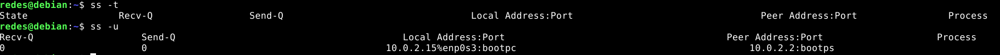

### c. Obtener sólo los servicios TCP que están esperando comunicaciones

`ss -t -l`

### d. Obtener sólo los servicios UDP que están esperando comunicaciones.

`ss -u -l`

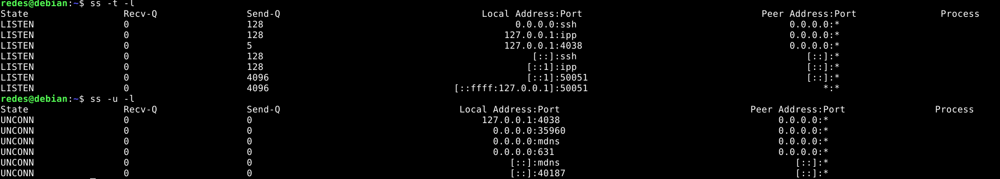

### e. Repetir los anteriores para visualizar el proceso del sistema asociado a la conexión.

??? es usando `-p`?

### f. Obtenga la misma información planteada en los items anteriores usando el comando netstat.

a. `netstat -t -p TCP`
b. `netstat -t -p UDP`
c. `netstat -t -l -p TCP`
d. `netstat -t -l -p UDP`

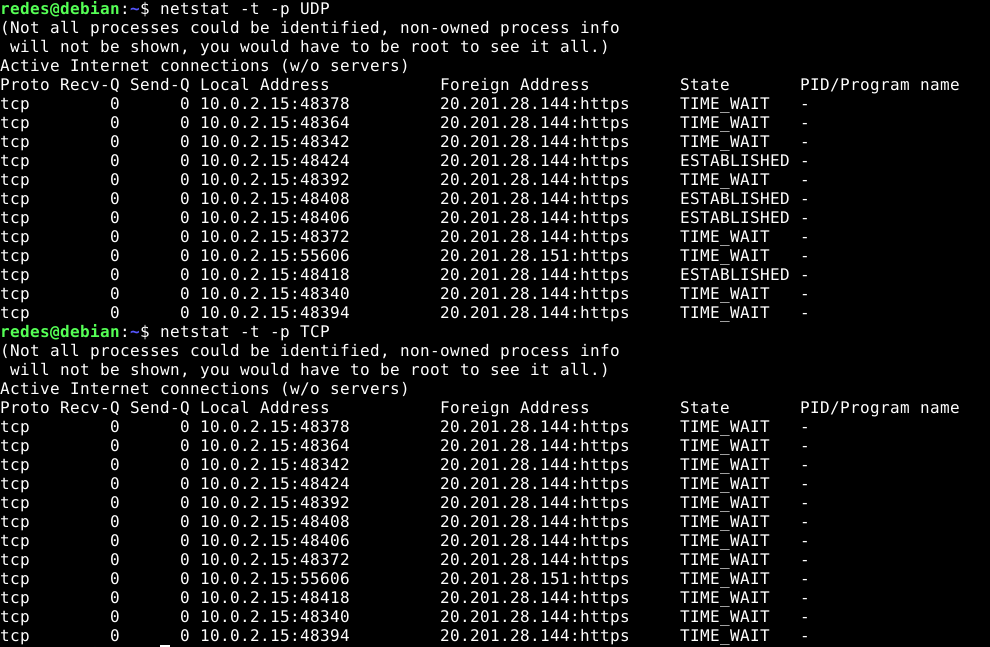
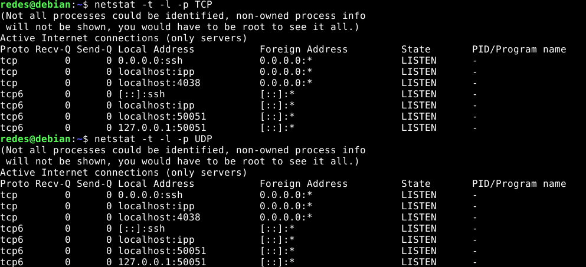

### 10. ¿Qué sucede si llega un segmento TCP con el flag SYN activo a un host que no tiene ningún proceso esperando en el puerto destino de dicho segmento (es decir, que dicho puerto no está en estado LISTEN)?

Si un host recibe un paquete TCP SYN cuyo puerto de destino es, por ejemplo, el número 80, y el host no está aceptando conexiones en dicho puerto (es decir, no está ejecutando un servidor web en el puerto 80). Entonces, el host enviará al origen un segmento especial de reinicio. Este segmento TCP tiene el bit indicador `RST` puesto en 1. Por lo tanto, cuando un host envía un segmento de reinicio, le está diciendo al emisor “_No tengo un socket para ese segmento. Por favor, no reenvies el segmento._”

### a. Utilice hping3 para enviar paquetes TCP al puerto destino 22 de la máquina virtual con el flag SYN activado.

La consola no me reconocia `hping3` asi que entre como sudo y me funciono.

`hping3 -p 22 -S localhost`: con `p` indico el puerto y con `S` indico que el flag SYN esta en 1.

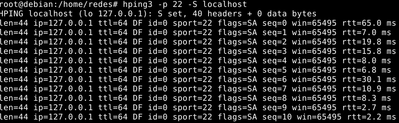

### b. Utilice hping3 para enviar paquetes TCP al puerto destino 40 de la máquina virtual con el flag SYN activado.

`hping3 -p 40 -S localhost`

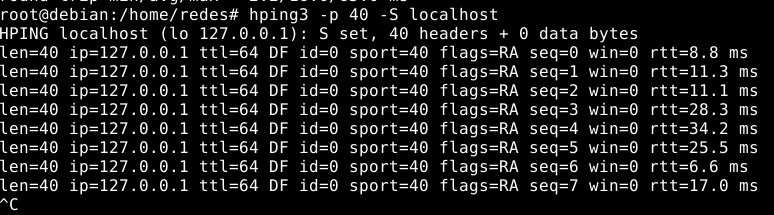

### c. ¿Qué diferencias nota en las respuestas obtenidas en los dos casos anteriores? ¿Puede explicar a qué se debe? (Ayuda: utilice el comando ss visto anteriormente).

La principal diferencia está en los frags de respuesta: el flag `SA` (conexión 22) y `RA` (conexión 40).  
Esto se debe a que un flag SA quiere decir que corresponde con SYN/ACK, es decir, que la comunicación ha sido aceptada, o lo que es lo mismo, que el puerto está abierto. De lo contrario, si el valor es RA corresponde a RST/ACK o lo que es lo mismo, que la comunicación no se ha realizado correctamente porque el puerto está cerrado o filtrado.
 
Utilizando el comando `ss` podemos observar que hay un socket escuchando el puerto 22 pero no hay uno escuchando el 40.

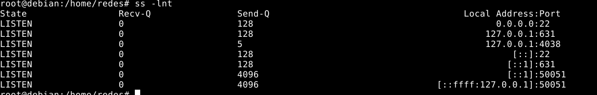

### 11. ¿Qué sucede si llega un datagrama UDP a un host que no tiene a ningún proceso esperando en el puerto destino de dicho datagrama (es decir, que dicho puerto no está en estado LISTEN)?

Cuando un host recibe un paquete UDP en el que el número de puerto de destino no se corresponde con un socket UDP activo, el host envía un datagrama ICMP especial.

### a. Utilice hping3 para enviar datagramas UDP al puerto destino 5353 de la máquina virtual.

`hping3 -2 -p 5353 -S localhost`: con `-2` indico el modo UDP.

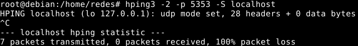

### b. Utilice hping3 para enviar datagramas UDP al puerto destino 40 de la máquina virtual.

`hping3 -2 -p 40 -S localhost`

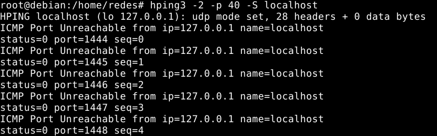

### c. ¿Qué diferencias nota en las respuestas obtenidas en los dos casos anteriores? ¿Puede explicar a qué se debe? (Ayuda: utilice el comando ss visto anteriormente).

No puedo observar lo que devuelve el inciso `a` pero estimo que los datagramas se envian bien ya que hay un socket escuchando en el puerto 5353, no se recibe respuesta alguna debido a que UDP no manda segmentos ACK. En cambio como no hay socket escuchando en el puerto 40, se recibe el paquete ICMP.
 
Utilizando el comando `ss` podemos observar que hay un socket escuchando el puerto 5353 pero no hay uno escuchando el 40.

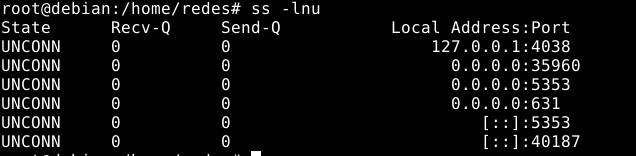

### 12. Investigue los distintos tipos de estado que puede tener una conexión TCP.

Los distintos estados que puede tener una conexión TCP son:

- _LISTEN_: indica que se esta esperando por una solicitud TCP
- _SYN-SENT_: este estado se torna cuando el lado del cliente envia una solicitud de conexión, representa el estado de esperar que se acepte la conexión.
- _SYN-RECEIVED_: representa la espera de confirmación de una solicitud de conexión después de ambos host haber recibido y enviado una solicitud de conexión.
- _ESTABLISHED_: representa una conexión abierta, el cliente TCP puede enviar y recibir segmentos TCP que contengan datos de carga útil (es decir, datos generados por la aplicación).
- _FIN-WAIT-1_: el cliente quiere cerrar la conexión y envía un segmento con el bit FIN puesto en 1. En este estado, el cliente TCP queda a la espera de un segmento TCP procedente del servidor que contenga un mensaje de reconocimiento.
- _FIN-WAIT-2_: el cliente espera a recibir otro segmento del servidor con el bit FIN puesto a 1, es decir, una solicitud de cerrar la conexión del lado del servidor
- _CLOSE-WAIT_: representa esperar la respuesta de terminar la conexión del lado del cliente
- _CLOSING_: esperar por el ACK de cerrar la conexión desde el servidor
- _LAST-ACK_: esperar por el ACK de cerrar la conexión enviado al servidor
- _TIME-WAIT_: esperar el tiempo suficiente para que el servidor pueda reenviar al cliente TCP el reconocimiento final en caso de que el paquete ACK se pierda.
- _CLOSED_: no existe conexión.

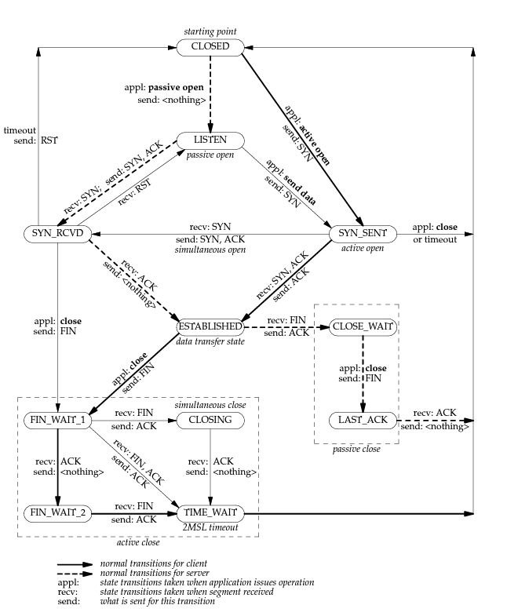

### 13. Use CORE para armar una topología como la siguiente, sobre la cual deberá realizar:

### a. En ambos equipos inspeccionar el estado de las conexiones y mantener abiertas ambas ventanas con el comando corriendo para poder visualizar los cambios a medida que se realiza el ejercicio. Ayuda: watch-n1 ’ss-nat’.

### b. EnServidor, utilice la herramienta ncat para levantar un servicio que escuche en el puerto 8001/TCP. Utilice la opcion-k para que el servicio sea persistente. Verifique el estado de las conexiones.

### c. Desde CLIENTE1 conectarse a dicho servicio utilizando también la herramienta ncat. Inspeccione el estado de las conexiones.

### d. Iniciar otra conexión desde CLIENTE1 de la misma manera que la anterior y verificar el estado de las conexiones. ¿De qué manera puede identificar cada conexión?

### e. En base a lo observado en el item anterior, ¿es posible iniciar más de una conexión desde el cliente al servidor en el mismo puerto destino? ¿Por qué? ¿Cómo se garantiza que los datos de una conexión no se mezclarán con los de la otra?

### Analice en el tráfico de red, los flags de los segmentos TCP que ocurren cuando:

### i. Cierra la última conexión establecida desde CLIENTE1. Evalúe los estados de las conexiones en ambos equipos.

### ii. Corta el servicio de ncat en el servidor (Ctrl+C). Evalúe los estados de las conexiones en ambos equipos.

### iii. Cierra la conexión en el cliente. Evalúe nuevamente los estados de las conexiones.

### 14. Dada la siguiente salida del comando ss, responda:

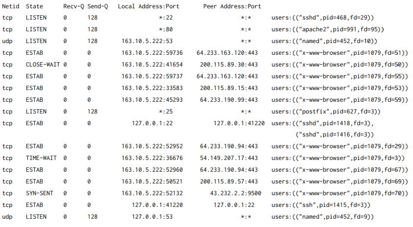

### a. ¿Cuántas conexiones hay establecidas?

Hay 9 conexiones con estado `ESTAB`. **Consultar: si la conexión es al mismo host local, cuenta como conexión?**

### b. ¿Cuántos puertos hay abiertos a la espera de posibles nuevas conexiones?

Hay `4` puertos abiertos, 22, 80, 53 y 25.

### c. El cliente y el servidor de las comunicaciones HTTPS (puerto 443), ¿residen en la misma máquina?

No, de ser así deberia haber algún socket en el puerto 443 y deberian coincidir las IPs.

### d. El cliente y el servidor de la comunicación SSH (puerto 22), ¿residen en la misma máquina?

**Consultar: cómo sé si el cliente y el servidor residen en la misma máquina?**
Estimo que si pero no sé por qué xd

### e. Liste los nombres de todos los procesos asociados con cada comunicación. Indique para cada uno si se trata de un proceso cliente o uno servidor.

**Consultar: cómo sé si es cliente o servidor?**

- `sshd`:
- `apache2`:
- `named`:
- `x-www-browser`:
- `postfix`:
- `ssh`:

### f. ¿Cuáles conexiones tuvieron el cierre iniciado por el host local y cuáles por el remoto?

Las conexiónes con el estado `TIME-WAIT` tuvieron el cierre iniciado por el host local, mientras que las que tienen el estado `CLOSE-WAIT` lo tienen por el host remoto.

### g. ¿Cuántas conexiones están aún pendientes por establecerse?

Hay una sola, es la que tiene de estado `SYN-SENT`.

### 15. Dadas las salidas de los siguientes comandos ejecutados en el cliente y el servidor, responder:

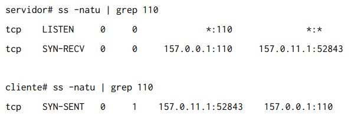

### a. ¿Qué segmentos llegaron y cuáles se están perdiendo en la red?

El segmento `SYN` enviado por el cliente llegó al servidor, pero el `SYNACK` del servidor no ha llegado al cliente.

### b. ¿A qué protocolo de capa de aplicación y de transporte se está intentando conectar el cliente?

El puerto `110` suele utilizarlo POP3.

### c. ¿Qué flags tendría seteado el segmento perdido?

- `SYN`: 1
- `ACK`: 1
