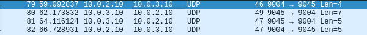

## Práctica 6 - Capa de Transporte - Parte II

### 1. ¿Cual es el puerto por defecto que se utiliza en los siguientes servicios? Web / SSH / DNS / Web Seguro / POP3 / IMAP / SMTP. Investigue en qué lugar en Linux y en Windows está descripta la asociación utilizada por defecto para cada servicio.

- Web: 80
- SSH: 22
- DNS: 53
- Web seguro: 443
- POP3: 110
- IMAP: 143
- SMTP: 25

_Linux_: `/etc/services`
_Windows_: `C:\WINDOWS\system32\drivers\etc\services`

### 2. Investigue qué es multicast. ¿Sobre cuál de los protocolos de capa de transporte funciona? ¿Se podría adaptar para que funcione sobre el otro protocolo de capa de transporte? ¿Por qué?

Multicast permite el envío simultáneo de información a varios usuarios de una red desde un punto o nodo. Sin embargo, a diferencia de la difusión amplia o broadcast, los destinatarios son previamente seleccionados por el emisor. Funciona con el protocolo UDP.

No se utiliza TCP porque en este protocolo el emisor requiere sincronizarse con el receptor en un handshake 1 a 1. El multicast tiene múltiples receptores, por lo que el emisor no puede realizar las sincronizaciones y no puede responder en caso de que se pierdan algunos paquetes durante la transferencia.

### 3. Investigue cómo funciona el protocolo de aplicación FTP teniendo en cuenta las diferencias en su funcionamiento cuando se utiliza el modo activo de cuando se utiliza el modo pasivo ¿En qué se diferencian estos tipos de comunicaciones del resto de los protocolos de aplicación vistos?

FTP es un protocolo de la capa de aplicación que utiliza los puertos 20 y 21. Permite transmitir archivos de un dispositivo a otro. Para poder transmitir datos se necesitan dos conexiones: una de control (establecer la conexion) y otra de datos (envio y recepcion de archivos); esta es la principal diferencia sobre los demás protocolos de la capa de aplicación debido a que sólo tienen 1 conexión.
<br>
FTP tiene dos modos:

- _Modo pasivo_: el cliente inicia la conexión de control a través del puerto 21 y el servidor le responde indicándole en qué puerto debe conectarse para realizar la conexión de datos. Luego el cliente se conecta al puerto que le enviaron para iniciar la conexión de datos.
- _Modo activo_: el cliente se inicia la conexión de control hacia el puerto 21 con el servidor enviándole un puerto aleatorio en el que va a realizar la conexión de datos. Luego, el servidor es el encargado de iniciar la conexión hacia el puerto que le envió el cliente (el servidor siempre usa el puerto 20 para la conexión de datos en modo activo).

### 4. Suponiendo Selective Repeat; tamaño de ventana 4 y sabiendo que E indica que el mensaje llegó con errores. Indique en el siguiente gráfico, la numeración de los ACK que el host B envía al Host A.

En Selective Repeat sólo los segmentos erroneos o perdidos serán retransmitidos, mientras que los correctos serán recibidos. El host receptor va a mantener el numero de secuencia mientras los bufferea a memoria y manda un NACK cuando el segmento esté perdido o dañado.

En este caso la ventana inicial es de: `[0,1,2,3]`. Se envian sin problemas el 0 y el 1 por lo que se mueve la ventana a: `[2,3,4,5]`. El problema surge cuando se envia un NACK con el segmento 2, la ventana no se moverá hasta que el mismo no se retransmita.


### 5. ¿Qué restricción existe sobre el tamaño de ventanas en el protocolo Selective Repeat?

La restricción de SR que existe sobre el tamaño de la ventana es que, el tamaño de esta, debe ser menor o igual que la mitad del tamaño del especio de números de secuencia. Esto se debe a que la ventana se implementa como un buffer circular, entonces se podría dar la situación en que el receptor no puede determinar si para un número de secuencia X, se trata del segmento X o el segmento X + Y (donde Y es una vuelta completa en el buffer circular). Esta situación se da cuando se pierden mensajes de ACK dirigidos al emisor.

### 6. De acuerdo a la captura TCP de la siguiente figura, indique los valores de los campos borroneados


1. `SYN`: Comienzo del saludo de 3 vías.
2. `3933822137`: Numero de secuencia del cliente.
3. `172.20.1.1`: IP del cliente.
4. `172.20.1.100`: IP del servidor.
5. `41749`: Puerto de origen.
6. `vce`: Puerto destino.
7. `ACK`: Ultimo paso del saludo de 3 vías.
8. `3933822138`: Numero de secuencia del cliente.
9. `1047471502`: Numero de ACK del cliente. Aumentado en 1 por el cliente.

### 7. Dada la sesión TCP de la figura, completar los valores marcados con un signo de interrogación.


### 8. ¿Qué es el RTT y cómo se calcula? Investigue la opción TCP timestamp y los campos TSval y TSecr.

El RTT es el tiempo que un paquete de datos tarda en volver a su emisor habiendo pasado por su destino. Puede definirse como el tiempo de ida y vuelta, y se mide en milisegundos.
<br>
La opción _timestamp_ permite que los endpoints puedan medir el RTT.
_TSval_ y _TSecr_ contienen información de timestamp que es enviada de ida y vuelta por los hosts.
TSval es un valor que se incluye en cada segmento para activar el timestamp y poder medir el RTT de cada paqiete. Este valor es repetido por el lado contrario de la conexión en el valor TSecr. Entonces, cuando el segmento está confirmado, el emisor de ese segmento puede simplemente substraer su actual timestamp del valor de TSecr para computar un buen calculo de RTT.
<br>
_Fuente_: `https://www.qacafe.com/resources/tcp-timestamp-option/`

### 9. Para la captura dada, responder las siguientes preguntas:

### a. ¿Cuántos intentos de conexiones TCP hay?

Hay 6 intentos de conexión. Estos se identifican por tener el bit `SYN` en 1.

### b. ¿Cuáles son la fuente y el destino (IP:port) para c/u?

Para todos los intentos de conexión la fuente es la IP: `10.0.2.10` mientras que el destino es `10.0.4.10`.

### c. ¿Cuántas conexiones TCP exitosas hay en la captura? ¿Cómo diferencia las exitosas de las que no lo son? ¿Cuáles flags encuentra en cada una?

Hay 4 conexiones exitosas en la captura, estas se diferencian por obtener el flag de ACK en 1 del retorno del destino; las que fallaron no reciben este flag en 1.

### d. Dada la primera conexión exitosa responder:

### i. ¿Quién inicia la conexión?

`10.0.2.10`.

### ii. ¿Quién es el servidor y quién el cliente?

El servidor es `10.0.4.10` y el cliente `10.0.2.10`.

### iii. ¿En qué segmentos se ve el 3-way handshake?

Se ve en los primeros 3 segmentos el 3-way handshake, esto es posible de observar gracias a los flags.


### iv. ¿Cuáles ISNs se intercambian?

???

### v. ¿Cuál MSS se negoció?

`1460`?

### vi. ¿Cuál de los dos hosts envia la mayor cantidad de datos (IP:port)?

**Consultar: existe una forma de filtrar esto?**
`10.0.2.10`.

### e. Identificar primer segmento de datos (origen, destino, tiempo, número de fila y número de secuencia TCP).


- Origen: `10.0.2.10`
- Destino: `10.0.4.10`
- Tiempo: `0.151826`.
- Nro. de fila: `6`? #CONSULTAR
- Nro. de secuencia: `1`.

### i. ¿Cuántos datos lleva?

Cuando abro el paquete la sección data me indica `24 bytes`. Sin embargo, todo el paquete pesa `90 bytes`.

### ii. ¿Cuándo es confirmado (tiempo, número de fila y número de secuencia TCP)?

- Tiempo: `0.151925`.
- Nro. de fila: `7`? #CONSULTAR
- Nro. de secuencia: `1`.

### iii. La confirmación, ¿qué cantidad de bytes confirma?

Confirma `25` bytes.

### f. ¿Quién inicia el cierre de la conexión? ¿Qué flags se utilizan? ¿En cuáles segmentos se ve (tiempo, número de fila y número de secuencia TCP)?

El cierre de conexión es iniciado por `10.0.2.10`. Utiliza los flags: `FIN`, `PSH` y `ACK`. Se observa en los 3 últimos segmentos:

- Tiempo: `75.090`, `75.091` y `75.247`
- Nro. de fila: `958`, `959` y `960`.
- Nro. de secuencia: `786289`, `1` y `786458`.

### 10. Responda las siguientes preguntas respecto del mecanismo de control de flujo.

### a. ¿Quién lo activa? ¿De qué forma lo hace?

Lo activa el receptor, regulando la velocidad de envio del emisor. Permitiendole enviar sólo la cantidad de datos que quepan en el buffer.
Esto lo hace utilizando una ventana de recepción, el emisor sólo podrá enviar la cantidad indicada por la ventana de recepción. En caso de que se llene el receptor, la ventana será 0.

### b. ¿Qué problema resuelve?

El control de flujo se usa para evitar que un emisor envíe datos de forma más rápida de la que el receptor puede recibirlos y procesarlos.

### c. ¿Cuánto tiempo dura activo y qué situación lo desactiva?

???

### 11. Responda las siguientes preguntas respecto del mecanismo de control de congestión.

### a. ¿Quién lo activa el mecanismo de control de congestión? ¿Cuáles son los posibles disparadores?

Se activa si se determina que hay congestión de red, esto se asume si hay paquetes perdidos (la pérdida de paquetes se evalúa en función de los paquetes de reconocimiento recibidos y no recibidos), se modifica la ventana de congestión de forma que el emisor ralentice el envío de sus paquetes. Si se determina que no hay congestión se modificará la ventana de congestión de forma que el emisor pueda enviar más paquetes.

### b. ¿Qué problema resuelve?

La ventana introducida para control de congestión busca regular la cantidad de paquetes enviados en función de la percepción que tiene TCP de la congestión.

### c. Diferencie slow start de congestion-avoidance.

_Slow start_ es un algoritmo para el cálculo de la ventana de congestión aplicado al principio de la conexión, y hasta que se alcanza el umbral de congestión. Consiste en:

- La ventana de congestión se inicia con el valor de un segmento de tamaño máximo (MSS).
- Cada vez que se recibe un ACK, la ventana de congestión se incrementa en tantos bytes como hayan sido reconocidos en el ACK recibido. En la práctica, esto supone que el tamaño de la ventana de congestión será el doble por cada RTT, lo que da lugar a un crecimiento exponencial de la ventana.
- Cuando un ACK no llega al transmisor:
  - Se toma como una señal de congestión en la red y se reinicia la ventana de congestión a un MSS.
  - Se aplica el algoritmo de _congestion avoidance_.

_Congestion Avoidance_ se encarga de la violación que puede producirse cuando el tiempo de retransmisión es demasiado corto. Cada vez que se recibe un ACK la ventana de congestión se incrementa un número de bytes igual al MSS. En la práctica, esto supone que la ventana crece de manera lineal.

### 12. Para la captura dada, responder las siguientes preguntas.

### a. ¿Cuántas comunicaciones (srcIP,srcPort,dstIP,dstPort) UDP hay en la captura?

Hay muchas, dentro de ellas:

_Conexion 1:_

- Source: `10.0.2.10`
- Source port: `0`
- Destination: `10.0.30.10`
- Destination port: `8003`

_Conexion 2:_ En esta conexión el destino y el origen se alternar (tanto IP como puertos).

- Source: `10.0.2.10`
- Source port: `9004`
- Destination: `10.0.3.10`
- Destination port: `9045`

_Conexion 3:_

- Source: `10.0.2.10`
- Source port: `9004`
- Destination: `1.1.1.1`
- Destination port: `9045`

_Conexion 4:_ En esta conexión el destino y el origen se alternar (tanto IP como puertos).

- Source: `10.0.2.10`
- Source port: `59053`
- Destination: `10.0.4.10`
- Destination port: `8003`

### b. ¿Cómo se podrían identificar las exitosas de las que no lo son?

Las puedo identificar visualmente porque algunos paquetes estan en color rojo, estimo que esas seran las erroneas.

### c. ¿UDP sigue el modelo cliente/servidor?

**CONSULTAR: NO ESTOY SEGURA**
No, UDP no es orientado a cliente/servidor ya que no existe una conexion entre ambos, no hay handshaking.

### d. ¿Qué servicios o aplicaciones suelen utilizar este protocolo?

Las aplicaciones que usan UDP son:

- Protocolo de Transferencia de Ficheros Trivial (TFTP)
- Sistema de Nombres de Dominio (DNS) servidor de nombres
- Llamada a Procedimiento Remoto (RPC), usado por el Sistema de Ficheros en Red (NFS)
- Sistema de Computación de Redes (NCS)
- Protocolo de Gestión Simple de Redes (SNMP)

### e. ¿Qué hace el protocolo UDP en relación al control de errores?

El protocolo UDP es un protocolo no orientado a la conexión, de manera que no proporciona ningún tipo de control de errores ni de flujo, aunque sí utiliza mecanismos de detección de errores. En caso de detectar un error, el UDP no entrega el datagrama a la aplicación, sino que lo descarta.

### f. Con respecto a los puertos vistos en las capturas, ¿observa algo particular que lo diferencie de TCP?

Si, UDP tiene muchos menos campos de información/headers que TCP. UDP parece ser mucho menor complejo en cuanto a TCP debido a eso.

### g. Dada la primera comunicación en la cual se ven datos en ambos sentidos (identificar el primer datagrama):

### i. ¿Quién envía el primer datagrama (srcIP,srcPort)?



- Source: `10.0.2.10`
- Source port: `9004`

### ii. ¿Cuantos datos se envían en un sentido y en el otro?

Desde `10.0.2.10` se envian 4 y luego 5 bytes.
Desde `10.0.3.10` se envian 7 y luego 5 bytes.

### h. ¿Se puede calcular un RTT?

**CONSULTAR**

## Programación de sockets

### 13. Desarrolle un cliente y un servidor, donde el cliente envíe un mensaje al servidor y este último imprima en pantalla el contenido del mismo.

### a. Utilizando UDP.

_Cliente:_

```py
from socket import *

serverName = ’hostname’
serverPort = 12000
clientSocket = socket(AF_INET, SOCK_DGRAM)
message = raw_input(’Escriba una frase en minúsculas:’)
clientSocket.sendto(message.encode(),(serverName, serverPort))
modifiedMessage, serverAddress = clientSocket.recvfrom(2048)
print(modifiedMessage.decode())
clientSocket.close()
```

_Servidor:_

```py
from socket import *

serverPort = 12000
serverSocket = socket(AF_INET, SOCK_DGRAM)
serverSocket.bind((’’, serverPort))
print(”El servidor está listo para recibir”)
while True:
    message, clientAddress = serverSocket.recvfrom(2048)
    modifiedMessage = message.decode().upper()
    serverSocket.sendto(modifiedMessage.encode(), clientAddress)

```

### b. Utilizando TCP.

_Cliente:_

```py
from socket import *

serverName = ’servername’
serverPort = 12000
clientSocket = socket(AF_INET, SOCK_STREAM)
clientSocket.connect((serverName,serverPort))
entence = raw_input(’Escriba una frase en minúsculas:’)
clientSocket.send(sentence.encode())
modifiedSentence = clientSocket.recv(1024)
print(’From Server: ’, modifiedSentence.decode())
clientSocket.close()
```

_Servidor:_

```py
from socket import *

serverPort = 12000
serverSocket = socket(AF_INET,SOCK_STREAM)
serverSocket.bind((’’,serverPort))
serverSocket.listen(1)
print(’El servidor está listo para recibir’)
while True:
    connectionSocket, addr = serverSocket.accept()
    sentence = connectionSocket.recv(1024).decode()
    capitalizedSentence = sentence.upper()
    connectionSocket.send(capitalizedSentence.encode())
    connectionSocket.close()
```

### 14. Compare ambas implementaciones. ¿Qué diferencia nota entre la implementación de cada una? ¿Cuál le parece más simple?

UDP al ser un servicio no fiable, no orientado a la conexión, la implementación del ejercicio es mucho más simple.
