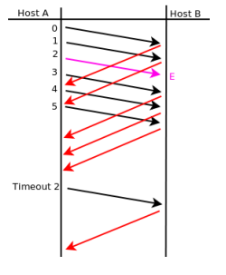
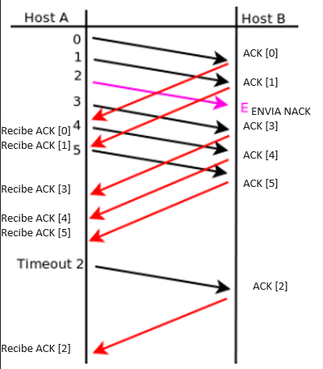
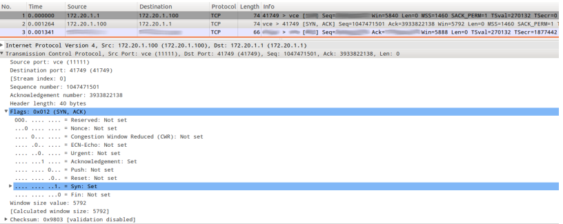
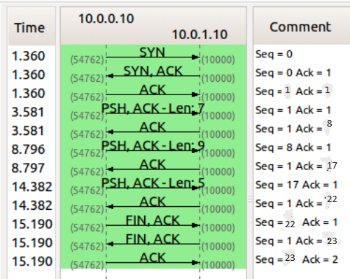
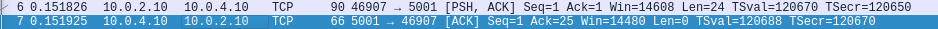

## Práctica 6 - Capa de Transporte - Parte II

### 1. ¿Cual es el puerto por defecto que se utiliza en los siguientes servicios? Web / SSH / DNS / Web Seguro / POP3 / IMAP / SMTP. Investigue en qué lugar en Linux y en Windows está descripta la asociación utilizada por defecto para cada servicio.

- Web: 80
- SSH: 22
- DNS: 53
- Web seguro: 443
- POP3: 110
- IMAP: 143
- SMTP: 25

_Linux_: `/etc/services`
_Windows_: `C:\WINDOWS\system32\drivers\etc\services`

### 2. Investigue qué es multicast. ¿Sobre cuál de los protocolos de capa de transporte funciona? ¿Se podría adaptar para que funcione sobre el otro protocolo de capa de transporte? ¿Por qué?

Multicast permite el envío simultáneo de información a varios usuarios de una red desde un punto o nodo. Sin embargo, a diferencia de la difusión amplia o broadcast, los destinatarios son previamente seleccionados por el emisor. Funciona con el protocolo UDP.

No se utiliza TCP porque en este protocolo el emisor requiere sincronizarse con el receptor en un handshake 1 a 1. El multicast tiene múltiples receptores, por lo que el emisor no puede realizar las sincronizaciones y no puede responder en caso de que se pierdan algunos paquetes durante la transferencia.

### 3. Investigue cómo funciona el protocolo de aplicación FTP teniendo en cuenta las diferencias en su funcionamiento cuando se utiliza el modo activo de cuando se utiliza el modo pasivo ¿En qué se diferencian estos tipos de comunicaciones del resto de los protocolos de aplicación vistos?

FTP es un protocolo de la capa de aplicación que utiliza los puertos 20 y 21. Permite transmitir archivos de un dispositivo a otro. Para poder transmitir datos se necesitan dos conexiones: una de control (establecer la conexion) y otra de datos (envio y recepcion de archivos); esta es la principal diferencia sobre los demás protocolos de la capa de aplicación debido a que sólo tienen 1 conexión.
 
FTP tiene dos modos:

- _Modo pasivo_: el cliente inicia la conexión de control a través del puerto 21 y el servidor le responde indicándole en qué puerto debe conectarse para realizar la conexión de datos. Luego el cliente se conecta al puerto que le enviaron para iniciar la conexión de datos.
- _Modo activo_: el cliente se inicia la conexión de control hacia el puerto 21 con el servidor enviándole un puerto aleatorio en el que va a realizar la conexión de datos. Luego, el servidor es el encargado de iniciar la conexión hacia el puerto que le envió el cliente (el servidor siempre usa el puerto 20 para la conexión de datos en modo activo).

### 4. Suponiendo Selective Repeat; tamaño de ventana 4 y sabiendo que E indica que el mensaje llegó con errores. Indique en el siguiente gráfico, la numeración de los ACK que el host B envía al Host A.

En Selective Repeat sólo los segmentos erroneos o perdidos serán retransmitidos, mientras que los correctos serán recibidos. El host receptor va a mantener el numero de secuencia mientras los bufferea a memoria y manda un NACK cuando el segmento esté perdido o dañado.

En este caso la ventana inicial es de: `[0,1,2,3]`. Se envian sin problemas el 0 y el 1 por lo que se mueve la ventana a: `[2,3,4,5]`. El problema surge cuando se envia un NACK con el segmento 2, la ventana no se moverá hasta que el mismo no se retransmita.

### 5. ¿Qué restricción existe sobre el tamaño de ventanas en el protocolo Selective Repeat?

La restricción de SR que existe sobre el tamaño de la ventana es que, el tamaño de esta, debe ser menor o igual que la mitad del tamaño del especio de números de secuencia. Esto se debe a que la ventana se implementa como un buffer circular, entonces se podría dar la situación en que el receptor no puede determinar si para un número de secuencia X, se trata del segmento X o el segmento X + Y (donde Y es una vuelta completa en el buffer circular). Esta situación se da cuando se pierden mensajes de ACK dirigidos al emisor.

### 6. De acuerdo a la captura TCP de la siguiente figura, indique los valores de los campos borroneados

1. `SYN`: Comienzo del saludo de 3 vías.
2. `3933822137`: Numero de secuencia del cliente.
3. `172.20.1.1`: IP del cliente.
4. `172.20.1.100`: IP del servidor.
5. `41749`: Puerto de origen.
6. `vce`: Puerto destino.
7. `ACK`: Ultimo paso del saludo de 3 vías.
8. `3933822138`: Numero de secuencia del cliente.
9. `1047471502`: Numero de ACK del cliente. Aumentado en 1 por el cliente.

### 7. Dada la sesión TCP de la figura, completar los valores marcados con un signo de interrogación.

### 8. ¿Qué es el RTT y cómo se calcula? Investigue la opción TCP timestamp y los campos TSval y TSecr.

El RTT es el tiempo que un paquete de datos tarda en volver a su emisor habiendo pasado por su destino. Puede definirse como el tiempo de ida y vuelta, y se mide en milisegundos.
 
La opción _timestamp_ permite que los endpoints puedan medir el RTT.
_TSval_ y _TSecr_ contienen información de timestamp que es enviada de ida y vuelta por los hosts.
TSval es un valor que se incluye en cada segmento para activar el timestamp y poder medir el RTT de cada paqiete. Este valor es repetido por el lado contrario de la conexión en el valor TSecr. Entonces, cuando el segmento está confirmado, el emisor de ese segmento puede simplemente substraer su actual timestamp del valor de TSecr para computar un buen calculo de RTT.
 
_Fuente_: `https://www.qacafe.com/resources/tcp-timestamp-option/`

### 9. Para la captura dada, responder las siguientes preguntas:

### a. ¿Cuántos intentos de conexiones TCP hay?

Hay 6 intentos de conexión. Estos se identifican por tener el bit `SYN` en 1.

### b. ¿Cuáles son la fuente y el destino (IP:port) para c/u?

Para todos los intentos de conexión la fuente es la IP: `10.0.2.10` mientras que el destino es `10.0.4.10`.

### c. ¿Cuántas conexiones TCP exitosas hay en la captura? ¿Cómo diferencia las exitosas de las que no lo son? ¿Cuáles flags encuentra en cada una?

Hay 4 conexiones exitosas en la captura, estas se diferencian por obtener el flag de ACK en 1 del retorno del destino; las que fallaron no reciben este flag en 1.

### d. Dada la primera conexión exitosa responder:

### i. ¿Quién inicia la conexión?

`10.0.2.10`.

### ii. ¿Quién es el servidor y quién el cliente?

El servidor es `10.0.4.10` y el cliente `10.0.2.10`.

### iii. ¿En qué segmentos se ve el 3-way handshake?

Se ve en los primeros 3 segmentos el 3-way handshake, esto es posible de observar gracias a los flags.

### iv. ¿Cuáles ISNs se intercambian?

???

### v. ¿Cuál MSS se negoció?

`1460`?

### vi. ¿Cuál de los dos hosts envia la mayor cantidad de datos (IP:port)?

**Consultar: existe una forma de filtrar esto?**
`10.0.2.10`.

### e. Identificar primer segmento de datos (origen, destino, tiempo, número de fila y número de secuencia TCP).

- Origen: `10.0.2.10`
- Destino: `10.0.4.10`
- Tiempo: `0.151826`.
- Nro. de fila: `6`? #CONSULTAR
- Nro. de secuencia: `1`.

### i. ¿Cuántos datos lleva?

Cuando abro el paquete la sección data me indica `24 bytes`. Sin embargo, todo el paquete pesa `90 bytes`.

### ii. ¿Cuándo es confirmado (tiempo, número de fila y número de secuencia TCP)?

- Tiempo: `0.151925`.
- Nro. de fila: `7`? #CONSULTAR
- Nro. de secuencia: `1`.

### iii. La confirmación, ¿qué cantidad de bytes confirma?

Confirma `25` bytes.

### f. ¿Quién inicia el cierre de la conexión? ¿Qué flags se utilizan? ¿En cuáles segmentos se ve (tiempo, número de fila y número de secuencia TCP)?

El cierre de conexión es iniciado por `10.0.2.10`. Utiliza los flags: `FIN`, `PSH` y `ACK`. Se observa en los 3 últimos segmentos:

- Tiempo: `75.090`, `75.091` y `75.247`
- Nro. de fila: `958`, `959` y `960`.
- Nro. de secuencia: `786289`, `1` y `786458`.
