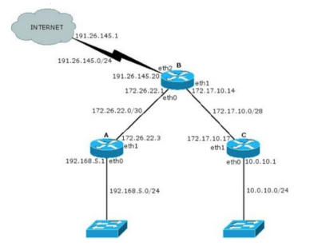
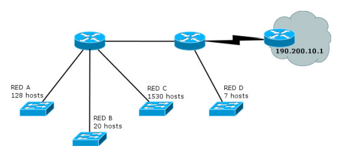

## Práctica 7 - Capa de Red - Direccionamiento

## Introducción

### 1. ¿Qué servicios presta la capa de red? ¿Cuál es la PDU en esta capa? ¿Qué dispositivo es considerado sólo de la capa de red?

La capa de red proporciona servicios de _reenvio_ y _enrutamiento_ de paquetes entre diferentes hosts. Esta capa recibe un segmento de la capa de transporte, lo encapsula en un datagrama y lo envia a un host receptor el cual recibira el datagrama y enviará los datos a la capa de transporte.

El PDU de esta capa es el _datagrama_.

El _router_ es el dispositivo es considerado sólo de la capa de red. El router no implementa capas superior a la capa de red. Cada router tiene una tabla de reenvio.

### 2. ¿Por qué se lo considera un protocolo de mejor esfuerzo?

La capa de red de Internet proporciona un servicio de _best-effort_, esto indica que el servicio no asegura la temporización relativa entre paquetes, tampoco está garantizado que los paquetes se reciban en el orden que fueron emitidos y tampoco se garantiza la entrega de los paquetes transmitidos. Por tanto, teniendo en cuenta esta definición, una red que no entregara los paquetes al destino satisfaría la definición de servicio de entrega de mejor esfuerzo. Por ende, se puede decir que un servicio de mejor esfuerzo no proporciona ningun servicio en absoluto.

### 3. ¿Cuántas redes clase A, B y C hay? ¿Cuántos hosts como máximo pueden tener cada una?

| Clase A                     | Clase B                  | Clase C                    |
| --------------------------- | ------------------------ | -------------------------- |
| Cantidad de redes: 126      | Cantidad de redes: 16384 | Cantidad de redes: 2097152 |
| Cantidad de hosts: 16777214 | Cantidad de hosts: 65534 | Cantidad de hosts: 254     |

### 4. ¿Qué son las subredes? ¿Por qué es importante siempre especificar la máscara de subred asociada?

Las subredes surgen cuando una red se vuelve muy grande. El concepto de máscara indica en una dirección IP qué bits son de red y qué bits son de host. Con el uso de redes con clases, la máscara estaba implícita en la dirección de clase, ya que se conocía a priori los bits para red y los bits para host. Cuando se creó el concepto de subredes también se les asoció una máscara de subred, que resultó de utilizar algunos bits de hosts para crear subredes y de esta manera obtener varias subredes con menos hosts cada una.

### 5. ¿Cuál es la finalidad del campo Protocol en la cabecera IP? ¿A qué campos de la capa de transporte se asemeja en su funcionalidad?

El campo _Protocol_ solo se suele emplear cuando un datagrama IP alcanza su destino final. El valor de este campo indica el protocolo específico de la capa de transporte al que se pasarán los datos contenidos en ese datagrama IP. Por ejemplo, un valor de 6 indica que los datos se pasan a TCP, mientras que un valor igual a 17 indica que los datos se pasan a UDP.

El _número de protocolo_ especificado en el datagrama IP desempeña un papel análogo al del campo que almacena el _número de puerto_ en un segmento de la capa de transporte. El número de protocolo es el elemento que enlaza las capas de red y de transporte, mientras que el número de puerto es el componente que enlaza las capas de transporte y de aplicación.

## División en subredes

### 6. Para cada una de las siguientes direcciones IP (172.16.58.223/26, 163.10.5.49/27, 128.10.1.0/23, 10.1.0.0/24, 8.40.11.179/12) determine:

| Red              | Clase | Dir. subred   | Max hosts | Dir broadcast | Rango |
| ---------------- | ----- | ------------- | --------- | ------------- | ----- |
| 172.16.58.223/26 | B     | 172.16.58.192 | 62        | 172.16.58.255 |       |
| 163.10.5.49/27   | B     | 163.10.5.32   | 30        | 163.10.5.63   |       |
| 128.10.1.0/23    | B     | 128.10.0.0    | 510       | 128.10.1.255  |       |
| 10.1.0.0/24      | A     | 10.1.0.0      | 254       | 10.1.0.255    |       |
| 8.40.11.179/12   | A     | 8.32.0.0      | 1048574   | 8.47.255.255  |       |

### 7. Su organización cuenta con la dirección de red 128.50.10.0. Indique:

### a. ¿Es una dirección de red o de host?

Es una dirección de host, ya que la sección de hosts esta siendo utilizada.

### b. Clase a la que pertenece y máscara de clase.

Pertenece a la clase B. La máscara de esta clase es: `255.255.0.0`.

### c. Cantidad de hosts posibles.

`65634`

### d. Se necesitan crear, al menos, 513 subredes. Indique:

### i. Máscara necesaria.

`11111111 11111111 11111111 11000000`, lo que equivale a `255.255.255.192`

### ii. Cantidad de redes asignables.

2^10 = `1024`

### iii. Cantidad de hosts por subred.

2^6-2 = `62`

### iv. Dirección de la subred 710.

1. Le resto 1 a la subred y la escribo en binario: `1011000101`
2. Ubicar el número obtenido en la dirección IP ocupando la posición de los bits asignados a subred: `10000000 00110010 10110001 01000000` --> `128.50.177.64`

### 8. Si usted estuviese a cargo de la administración del bloque IP 195.200.45.0/24

### a. ¿Qué máscara utilizaría si necesita definir al menos 9 subredes?

`11111111 11111111 11111111 11110000`, es decir, `255.255.255.240/28`

### b. Indique la dirección de subred de las primeras 9 subredes.

1. 195.200.45.0
2. 195.200.45.16
3. 195.200.45.32
4. 195.200.45.48
5. 195.200.45.64
6. 195.200.45.80
7. 195.200.45.96
8. 195.200.45.112
9. 195.200.45.128

### c. Seleccione una e indique dirección de broadcast y rango de direcciones asignables en esa subred.

La direccion de broadcast de la subred 9 es `195.200.45.143`. Su rango de direccines es: `195.200.45.129 - 195.200.45.142`.

### 9. Dado el siguiente gráfico:

### a. Verifique si es correcta la asignación de direcciones IP y, en caso de no serlo, modifique la misma para que lo sea.

- La dirección IP `172.26.22.3` corresponde al broadcast de la subred. La dirección correcta sería la que representa a la red (172.26.22.0)
- La dirección `172.17.10.17` está fuera del rango de la subred 172.17.10.0.

### b. ¿Cuántos bits se tomaron para hacer subredes en la red 10.0.10.0/24? ¿Cuántas subredes se podrían generar?

Como es una direccion IP de clase A, podemos decir que se tomaron 16 bits para hacer subredes. En total se pueden generar 2^16 = `65536` subredes.

### c. Para cada una de las redes utilizadas indique si son públicas o privadas.

| Publicas     | Privadas    |
| ------------ | ----------- |
| 191.26.145.0 | 10.0.10     |
|              | 192.168.5.0 |
|              | 172.17.10.0 |
|              | 172.26.22.0 |

- IPs privadas de Clase A: `10.0.0.0 – 10.255.255.255`
- IPs privadas de Clase B: `172.16.0.0 – 172.31.255.255`
- IPs privadas de Clase C: `192.168.0.0 – 192.168.255.255`

## CIDR

### 10. ¿Qué es CIDR (Class Interdomain routing)? ¿Por qué resulta útil?

La estrategia de asignación de direcciones en Internet se conoce como _enrutamiento entre dominios sin clase_ (**CIDR, Classless Interdomain Routing**). CIDR generaliza la noción de direccionamiento de subred. Al igual que sucede con el direccionamiento de subredes, la dirección IP de 32 bits se divide en dos partes y de nuevo se expresa en notación decimal con puntos como a.b.c.d/x, donde x indica el número de bits de la primera parte de la dirección. Los x bits más significativos de una dirección en el formato a.b.c.d/x constituyen la parte de red de la dirección IP y a menudo se los denomina prefijo (o prefijo de red) de la dirección.

CIDR es útil ya que permite máscaras de subred de longitud variable (VLSM) para optimizar la asignación de direcciones IP y utilizar resumen de rutas para disminuir el tamaño de las tablas de enrutamiento.

### 11. ¿Cómo publicaría un router las siguientes redes si se aplica CIDR?

### a. 198.10.1.0/24

### b. 198.10.0.0/24

### c. 198.10.3.0/24

### d. 198.10.2.0/24

Las redes se agrupan mediante CIDR a partir del bit que son diferentes, es decir, desde 198.10 son iguales pero a partir del punto que le sigue son diferentes. La mascara que se aplica para que todas den el mismo resultado es: `198.10.0.0/22`.

`11000110 00001010 000000 01 00000000 - 198.10.1.0/24`

`11000110 00001010 000000 00 00000000 - 198.10.0.0/24`

`11000110 00001010 000000 10 00000000 - 198.10.2.0/24`

`11000110 00001010 000000 11 00000000 - 198.10.3.0/24`

Se puede observar que cambia a partir del bit 22, por lo que las podemos agrupar en una dirección con esa máscara.

`11111111 11111111 111111 00 00000000 - 198.10.0.0/22`

### 12. Listar las redes involucradas en los siguientes bloques CIDR:

- _200.56.168.0/21_: `200.56.168.0/24 - 200.56.175.0/24`
- _195.24.0.0/13_: `195.24.0.0/24 - 195.31.255.0/24`
- _195.24/13_: `195.24.0.0/24 - 195.31.255.0/24`

La ultima es una trampa ya que cuadno tengo dos `0` seguidos en una direccion IP puedo obviarlos.

### 13. El bloque CIDR 128.0.0.0/2 o 128/2, ¿Equivale a listar todas las direcciones de red de clase B? ¿Cuál sería el bloque CIDR que agrupa todas las redes de clase A?

Si, el bloque CIDR `128.0.0.0/2` equivale a todas las direcciones de red de la clase B.
El bloque CIDR `0.0.0.0/1` equivale a todas las redes de la clase A.

## VLSM

### 14. ¿Qué es y para qué se usa VLSM?

La técnica de VLSM (variable-length subnet masking) consiste en realizar divisiones en subredes con máscaras de longitud variable y es otra de las técnicas surgidas para frenar el agotamiento de direcciones IPv4. Básicamente, VLSM sugiere hacer varios niveles de división en redes para lograr máscaras más óptimas para cada una de las subredes que se necesiten.

### 15. Describa, con sus palabras, el mecanismo para dividir subredes utilizando VLSM.

- _Paso 1_: Subnetear para la red con mayor cantidad de hosts
- _Paso 2_: De las subredes obtenidas, asignar todas las que se puedan con el menor desperdicio posible
- _Paso 3_: Si aún quedan segmentos de red sin una subred asignada volver al paso 1.

### 16. Suponga que trabaja en una organización que tiene la red que se ve en el gráfico y debe armar el direccionamiento para la misma, minimizando el desperdicio de direcciones IP. Dicha organización posee la red 205.10.192.0/19, que es la que usted deberá utilizar.

### a. ¿Es posible asignar las subredes correspondientes a la topología utilizando subnetting sin vlsm? Indique la cantidad de hosts que se desperdicia en cada subred.

Utilizando subnetting fijo necesito 5 redes (una por cada red y la que conecta los routers), 2^3-2=6 asi que necesito 3 bits.

La mascara es:
`11001101 00001010 11000000 00000000 - red normal`

`11111111 11111111 11100000 00000000 - mascara de red`

`11111111 11111111 111111 00 00000000 - mascara de subred`

Me da 2^10-2=`1022` hosts. No me sirve porque necesito `1530`.

### b. Asigne direcciones a todas las redes de la topología. Tome siempre en cada paso la primer dirección de red posible.

La red C tiene `1530` hosts por lo que necesito `11` bits para satisfacer la red.

- `205.10.11000000.0/19`- red inicial
- `205.10.110 00 000.0/21`- red C --> `205.10.192.0/21`

La red A tiene `128` hosts así que necesito 8 bits. Subnetteo la red siguiente a la C: `205.10.110 01 000.0/21.`

- `205.10.110 01 000.0/24` - red A --> `205.10.200.0/24`

La red B tiene `20` hosts asi que necesito 5 bits. Subnetteola red siguiente a A: `205.10.11001 001.0/24`
`205.10.110010010. 000 00000/27` - red B --> `205.10.201.0/27`

La red D tiene `7` hosts asi que con 4 bits me alcanza. Subnetteo la red siguiente a B: `205.10.110010010. 001 0 0000/27`
`205.10.110010010. 001 0 0000/28` - red D --> `205.10.201.32/28`

### c. Para mantener el orden y el inventario de direcciones disponibles, haga un listado de todas las direcciones libres que le quedaron, agrupándolas utilizando CIDR.

### d. Asigne direcciones IP a todas las interfaces de la topología que sea posible.

### 17. Utilizando la siguiente topología y el bloque asignado, arme el plan de direccionamiento IPv4 teniendo en cuenta las siguientes restricciones: _Utilizar el bloque IPv4 200.100.8.0/22_.

Es una red de clase C. Su mascara es:

- _Red:_ `11001000 01100100 00001000 00000000`
- _Mascara de red:_ `11111111 11111111 11111100 00000000 `
- _Mascara de subred:_ `11001000 01100100 00001000 00000000 - 200.100.8.0/22`

### a. La red A tiene 125 hosts y se espera un crecimiento máximo de 20 hosts.

Para 125 hosts necesito 8 bits (`2^8-2 = 254`).

- _Mascara de red:_ `11111111 11111111 11111100 00000000 `
- _Mascara de subred:_ `11001000 01100100 00001 000 00000000 - 200.100.8.0/24` - Red de 254 hosts

### b. La red X tiene 63 hosts.

Para 63 hosts necesito 7 bits (`2^7-2 = 126`).

- _Mascara de A:_ `11001000 01100100 00001 000 10000000 - 200.100.8.128/24`
- _Mascara de subred:_ `11001000 01100100 00001 001 00000000 - 200.100.9.0/25` - Red de 126 hosts

### c. La red B cuenta con 60 hosts

Para 60 hosts necesito 6 bits (`2^6-2 = 62`).

- _Mascara de B:_ `11001000 01100100 00001 001 0 0000000 - 200.100.9.0/25`
- _Mascara de subred:_ `11001000 01100100 00001001 10 000000 - 200.100.9.128/26` - Red de 62 hosts

### d. La red Y tiene 46 hosts y se espera un crecimiento máximo de 18 hosts.

Para 64 hosts necesito 7 bits (`2^7-2 = 126`).

- _Mascara:_ `11001000 01100100 00001 001 00000000 - 200.100.8.128/24`
- _Mascara de subred:_ `11001000 01100100 00001010 00000000 - 200.100.10.0/25` - Red de 126 hosts

### e. En cada red, se debe desperciciar la menor cantidad de direcciones IP posibles. En este sentido, las redes utilizadas para conectar los routers deberán utilizar segmentos de red /30 de modo de desperdiciar la menor cantidad posible de direcciones IP.

### 18. Asigne direcciones IP en los equipos de la topología según el plan anterior.

## ICMP y Configuraciones IP

### 19. Describa qué es y para qué sirve el protocolo ICMP

Los hosts y los routers utilizan ICMP para intercambiarse información acerca de la capa de red. El uso más típico de ICMP es la generación de informes de error. Por ejemplo, al ejecutar una sesión Telnet, FTP o HTTP, puede encontrarse con un mensaje de error como “Red de destino inalcanzable”. Este mensaje tiene su origen en ICMP. En algún momento, un router IP no ha podido encontrar una ruta hasta el host especificado en su aplicación Telnet, FTP o HTTP, y dicho router ha creado y enviado un mensaje ICMP de tipo 3 a su host para informarle del error.

ICMP a menudo se considera parte de IP pero, en sentido arquitectónico, se encuentra justo encima de IP, ya que los mensajes ICMP son transportados dentro de los datagramas IP. Es decir, los mensajes ICMP son transportados como carga útil de IP, al igual que los segmentos TCP o UDP son transportados como carga útil de IP. De forma similar, cuando un host recibe un datagrama IP con ICMP especificado como el protocolo de la capa superior, demultiplexa el contenido del datagrama para ICMP, al igual que demultiplexaría el contenido de un datagrama para TCP o UDP.

Los mensajes ICMP tienen un campo de tipo y un campo de código, y contienen la cabecera y los 8 primeros bytes del datagrama IP que ha dado lugar a la generación del mensaje ICMP en primer lugar (de modo que el emisor puede determinar qué datagrama ha producido el error).

### a. Analice cómo funciona el comando ping.

Cuando ejecutamos una solicitud de `PING`, este envía un mensaje ICMP Echo Request al host de destino, y cuando el host de destino le responde, lo hace con un mensaje ICMP Echo Reply. A raíz de esa respuesta, se calcula el tiempo mínimo, medio y máximo de respuesta. En caso de no recibir respuesta en un tiempo predeterminado, nos llegará el mensaje de que no hay conexión con el host, la red es inalcanzable o que no se encuentra la ruta al host.

### i. Indique el tipo y código ICMP que usa el ping.

Ping envía un mensaje ICMP de `Echo Request`, de tipo 8 y con código 0.

### ii. Indique el tipo y código ICMP que usa la respuesta de un ping

El host responde con un mensaje ICMP `Echo Reply`, de tipo 0 y código 0.

### b. Analice cómo funcionan comandos como traceroute/tracert de Linux/Windows y cómo manipulan el campo TTL de los paquetes IP.

`traceroute` y `tracert` son comandos de diagnóstico de red para mostrar posibles rutas (rutas) y medir los retrasos de tránsito de los paquetes a través de una red de IP. El historial de la ruta se registra como los tiempos de ida y vuelta de los paquetes recibidos de cada host sucesivo (nodo remoto) en la ruta (ruta); la suma de los tiempos medios en cada salto es una medida del tiempo total empleado para establecer la conexión. `Traceroute` procede a menos que todos (generalmente tres) paquetes enviados se pierdan más de dos veces; entonces se pierde la conexión y no se puede evaluar la ruta. `Ping`, por otro lado, solo calcula los tiempos finales de ida y vuelta desde el punto de destino.

### c. Indique la cantidad de saltos realizados desde su computadora hasta el sitio www.nasa.gov. Analice:

**CONSULTAR: se usa ping? -- se usa traceroute pero me da paja**

### i. Cómo hacer para que no muestre el nombre del dominio asociado a la IP de cada salta.

### ii. La razón de la aparición de \* en parte o toda la respuesta de un salto.

### d. Verifique el recorrido hacia los servidores de nombre del dominio unlp.edu.ar. En base al recorrido realizado, ¿podría confirmar cuál de ellos toma un camino distinto?

### 20. ¿Para que se usa el bloque 127.0.0.0/8? ¿Qué PC responde a los siguientes comandos?

El dispositivo de red _loopback_ es una interfaz de red virtual. Las direcciones del rango `127.0.0.0/8` son direcciones de loopback, de las cuales se utiliza, de forma mayoritaria, la `127.0.0.1` por ser la primera de dicho rango. Las direcciones de loopback pueden ser redefinidas en los dispositivos, incluso con direcciones IP públicas, una práctica común en los routers. Esta dirección se suele utilizar cuando una transmisión de datos tiene como destino el propio host. También se suele usar en tareas de diagnóstico de conectividad y validez del protocolo de comunicación.

A pesar de que sólo se usa la dirección única `127.0.0.1`, se reservan las direcciones desde la `127.0.0.0` hasta la `127.255.255.255`. Cualquier dirección dentro de este bloque producirá un loopback dentro del host local. Las direcciones dentro de este bloque no deben figurar en ninguna red.

### a. ping 127.0.0.1

`Host local`

### b. ping 127.0.54.43

`Host local`

### 21. Investigue para qué sirven los comandos ifconfig y route. ¿Qué comandos podría utilizar en su reemplazo? Inicie una topología con CORE, cree una máquina y utilice en ella los comandos anteriores para practicar sus diferentes opciones, mínimamente:

El comando `Route` se utiliza para visualizar y modificar la tabla de rutas. `Route print` muestra una lista con las rutas actuales conocidas por IP para el host. `Route add` se utiliza para añadir rutas a la tabla, y route delete se utiliza para borrar rutas de la tabla.

El comando `ifconfig` (configuración de interfaz) es una herramienta de gestión de red. Se utiliza para configurar y ver el estado de las interfaces de red en los sistemas operativos Linux. Con ifconfig, puede asignar direcciones IP, habilitar o deshabilitar interfaces, administrar la caché ARP, rutas y más.

Actualmente los dos comandos mencionados anteriormente están obsoletos, en su reemplazo se utiliza el comando `ip`.

### - Configurar y quitar una dirección IP en una interfaz.

_ifconfig_:

- _Modificar_:`ifconfig ens33 192.168.1.1/24`
- _Eliminar_: `ifconfig ens33 0.0.0.0`

_route_:

- _Modificar_: `DELETE <destino>`
- _Eliminar_: `CHANGE <destino> <máscara> <gateway> Metric <métrica> if <interfaz>`

### - Ver la tabla de ruteo de la máquina.

- `ifconfig`
- `route print`
