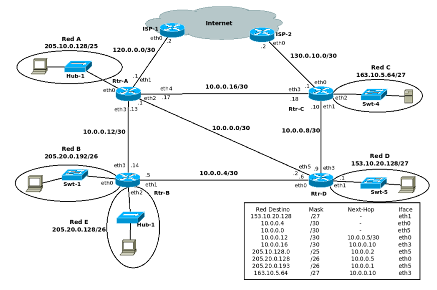

## Práctica 8 - Capa de Red - Fragmentación - Ruteo

## Fragmentación

### 2. Se tiene la siguiente red con los MTUs indicados en la misma. Si desde pc1 se envía un paquete IP a pc2 con un tamaño total de 1500 bytes (cabecera IP más payload) con el campo Identification = 20543, responder:

### a. Indicar IPs origen y destino y campos correspondientes a la fragmentación cuando el paquete sale de pc1.

- Origen: `10.0.0.10/24`, Destino: `10.0.2.20/24`, Tamaño total: `1500`, Identificacion: `20543`, DF: `0`, MF: `0`, Fragment offset: `0`

### b. ¿Qué sucede cuando el paquete debe ser reenviado por el router R1?

Debido a que R1 tiene un MTU de 600B se debe fragmentar el paquete IP saliente de pc1.

### c. Indicar cómo quedarían las paquetes fragmentados para ser enviados por el enlace entre R1 y R2.

1. Tamaño total: `520`, Identificacion: `20543`, DF: `0`, MF: `1`, Fragment offset: `0`

2. Tamaño total: `520`, Identificacion: `20543`, DF: `0`, MF: `1`, Fragment offset: `65`

3. Tamaño total: `472`, Identificacion: `20543`, DF: `0`, MF: `1`, Fragment offset: `130`

### d. ¿Dónde se unen nuevamente los fragmentos? ¿Qué sucede si un fragmento no llega?

Los fragmentos se unen nuevamente en PC2.

Si se pierde un fragmento se lo espera con el tiempo del TTL. Si el mismo finaliza, se retransmiten todos los fragmentos.

### e. Si un fragmento tiene que ser reenviado por un enlace con un MTU menor al tamaño del fragmento, ¿qué hará el router con ese fragmento?

Un paquete fragmentado puede volver a fragmentarse.

## Ruteo

### 3. ¿Qué es el ruteo? ¿Por qué es necesario?

El ruteo consiste en buscar y seleccionar la interfaz de salida y el
próximo salto, es decir, encontrar un camino entre todos los posibles.

El ruteo permite que un paquete pueda viajar en una red, en otras palabras, que un paquete vaya de un extremo al otro.

### 4. En las redes IP el ruteo puede configurarse en forma estática o en forma dinámica. Indique ventajas y desventajas de cada método.

**Ventajas:**

| Routing estatico                                                                                                                                                                                                                               | Routing dinamico                                                                                                                                                                                 |
| ---------------------------------------------------------------------------------------------------------------------------------------------------------------------------------------------------------------------------------------------- | ------------------------------------------------------------------------------------------------------------------------------------------------------------------------------------------------ |
| Ofrecen conexiones más fiables y estables.                                                                                                                                                                                                     | No tienes que pagar más por ellas. La mayoría de los proveedores de Internet asignan IPs dinámicas a sus clientes como parte de su plan de acceso normal.                                        |
| Suelen permitir mayores velocidades de carga y descarga.                                                                                                                                                                                       | En principio son más seguras. Es más díficil para un atacante rastrear y buscar debilidades en un equipo con una IP variable.                                                                    |
| Te dan un control exclusivo de tu IP. Nadie más puede usarla. Así evitas bloqueos o problemas por malos usos que no sean culpa tuya.                                                                                                           | Ofrecen mayor privacidad en Internet. A los sitios web les cuesta más rastrear lo que haces si tu IP va cambiando.                                                                               |
| Son ideales por ejemplo para jugadores online, proveedores o usuarios de telefonía y vídeo por Internet (VoIP) como Skype. También en servidores de todo tipo y servicios de alojamiento web. O en sistemas de redes privadas virtuales (VPN). | Su configuración en la red suele ser automática. No necesitas hacerla tú. Se encarga de ello lo que se llama un servidor DHCP.                                                                   |
|                                                                                                                                                                                                                                                | Optimizan el uso de recursos y abaratan costos. Cuando un equipo se desconecta de Internet u otra red ya "no necesita" su IP. Así puede reutilizarse asignándosela a otro equipo que se conecte. |

**Desventajas:**

| Routing estatico                                                                                                                                                                                                  | Routing dinamico                                    |
| ----------------------------------------------------------------------------------------------------------------------------------------------------------------------------------------------------------------- | --------------------------------------------------- |
| En principio son menos seguras. Los hackers u otros atacantes tienen más tiempo y oportunidades para atacar equipos con IPs que sean siempre iguales. Obligan a tomar medidas de seguridad extra y más rigurosas. | Es más fácil que la conexión falle o se interrumpa. |
| En general hay que pagar un precio adicional para tener una IP fija en Internet. Además no las ofrecen todos los proveedores de acceso. Tendrías que consultar al tuyo.                                           |                                                     |
| Lo normal es que haya que configurarlas a mano. Quien las usa debe tener más conocimientos de informática.                                                                                                        |                                                     |

### 5. Una máquina conectada a una red pero no a Internet, ¿tiene tabla de ruteo?

Si, la tabla de ruteo es necesaria para poder comunicar los dispositivos de la red. La unica diferencia con Internet es que una maquina tiene una red privada mientras que Internet es publica.

### 6. Observando el siguiente gráfico y la tabla de ruteo del router D, responder:

