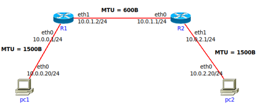

## Práctica 8 - Capa de Red - Fragmentación - Ruteo

## Fragmentación

### 2. Se tiene la siguiente red con los MTUs indicados en la misma. Si desde pc1 se envía un paquete IP a pc2 con un tamaño total de 1500 bytes (cabecera IP más payload) con el campo Identification = 20543, responder:

### a. Indicar IPs origen y destino y campos correspondientes a la fragmentación cuando el paquete sale de pc1.

- Origen: `10.0.0.10/24`, Destino: `10.0.2.20/24`, Tamaño total: `1500`, Identificacion: `20543`, DF: `0`, MF: `0`, Fragment offset: `0`

### b. ¿Qué sucede cuando el paquete debe ser reenviado por el router R1?

Debido a que R1 tiene un MTU de 600B se debe fragmentar el paquete IP saliente de pc1.

### c. Indicar cómo quedarían las paquetes fragmentados para ser enviados por el enlace entre R1 y R2.

Para fragmentar hay que tomar el valor máximo del MTU (600) y restarle el valor del header (580), luego hay que encontrar el multiplo de 8 más cercano a ese numero.

1. Tamaño total: `576`, Identificacion: `20543`, DF: `0`, MF: `1`, Fragment offset: `0`

2. Tamaño total: `576`, Identificacion: `20543`, DF: `0`, MF: `1`, Fragment offset: `72`

3. Tamaño total: `352`, Identificacion: `20543`, DF: `0`, MF: `1`, Fragment offset: `144`

### d. ¿Dónde se unen nuevamente los fragmentos? ¿Qué sucede si un fragmento no llega?

Los fragmentos se unen nuevamente en PC2.

Si se pierde un fragmento se lo espera con el tiempo del TTL. Si el mismo finaliza, se retransmiten todos los fragmentos.

### e. Si un fragmento tiene que ser reenviado por un enlace con un MTU menor al tamaño del fragmento, ¿qué hará el router con ese fragmento?

Un paquete fragmentado puede volver a fragmentarse.

## Ruteo

### 3. ¿Qué es el ruteo? ¿Por qué es necesario?

El ruteo consiste en buscar y seleccionar la interfaz de salida y el
próximo salto, es decir, encontrar un camino entre todos los posibles.

El ruteo permite que un paquete pueda viajar en una red, en otras palabras, que un paquete vaya de un extremo al otro.

### 4. En las redes IP el ruteo puede configurarse en forma estática o en forma dinámica. Indique ventajas y desventajas de cada método.

**Ventajas:**

| Routing estatico                                                                                                                                                                                                                               | Routing dinamico                                                                                                                                                                                 |
| ---------------------------------------------------------------------------------------------------------------------------------------------------------------------------------------------------------------------------------------------- | ------------------------------------------------------------------------------------------------------------------------------------------------------------------------------------------------ |
| Ofrecen conexiones más fiables y estables.                                                                                                                                                                                                     | No tienes que pagar más por ellas. La mayoría de los proveedores de Internet asignan IPs dinámicas a sus clientes como parte de su plan de acceso normal.                                        |
| Suelen permitir mayores velocidades de carga y descarga.                                                                                                                                                                                       | En principio son más seguras. Es más díficil para un atacante rastrear y buscar debilidades en un equipo con una IP variable.                                                                    |
| Te dan un control exclusivo de tu IP. Nadie más puede usarla. Así evitas bloqueos o problemas por malos usos que no sean culpa tuya.                                                                                                           | Ofrecen mayor privacidad en Internet. A los sitios web les cuesta más rastrear lo que haces si tu IP va cambiando.                                                                               |
| Son ideales por ejemplo para jugadores online, proveedores o usuarios de telefonía y vídeo por Internet (VoIP) como Skype. También en servidores de todo tipo y servicios de alojamiento web. O en sistemas de redes privadas virtuales (VPN). | Su configuración en la red suele ser automática. No necesitas hacerla tú. Se encarga de ello lo que se llama un servidor DHCP.                                                                   |
|                                                                                                                                                                                                                                                | Optimizan el uso de recursos y abaratan costos. Cuando un equipo se desconecta de Internet u otra red ya "no necesita" su IP. Así puede reutilizarse asignándosela a otro equipo que se conecte. |

**Desventajas:**

| Routing estatico                                                                                                                                                                                                  | Routing dinamico                                    |
| ----------------------------------------------------------------------------------------------------------------------------------------------------------------------------------------------------------------- | --------------------------------------------------- |
| En principio son menos seguras. Los hackers u otros atacantes tienen más tiempo y oportunidades para atacar equipos con IPs que sean siempre iguales. Obligan a tomar medidas de seguridad extra y más rigurosas. | Es más fácil que la conexión falle o se interrumpa. |
| En general hay que pagar un precio adicional para tener una IP fija en Internet. Además no las ofrecen todos los proveedores de acceso. Tendrías que consultar al tuyo.                                           |                                                     |
| Lo normal es que haya que configurarlas a mano. Quien las usa debe tener más conocimientos de informática.                                                                                                        |                                                     |

### 5. Una máquina conectada a una red pero no a Internet, ¿tiene tabla de ruteo?

Si, la tabla de ruteo es necesaria para poder comunicar los dispositivos de la red. La unica diferencia con Internet es que una maquina tiene una red privada mientras que Internet es publica.

### 6. Observando el siguiente gráfico y la tabla de ruteo del router D, responder:

### a. ¿Está correcta esa tabla de ruteo? En caso de no estarlo, indicar el o los errores encontrados. Escribir la tabla correctamente (no es necesario agregar las redes que conectan contra los ISPs)

Los errores son:

- _Next-Hop_ 10.0.0.5/30 --> esto es incorrecto ya que un hop nunca tiene un sufijo sino que es directamente una direccion IP.
- _Red destino_ 205.10.128.0 --> esta mal porque no es una direccion de la red A
- _Red destino_ 205.20.0.193 --> esta mal porque no es una direccion de la red E

### b. Con la tabla de ruteo del punto anterior, Red D, ¿tiene salida a Internet? ¿Por qué? ¿Cómo lo solucionaría? Suponga que los demás routers están correctamente configurados, con salida a Internet y que Rtr-D debe salir a Internet por Rtr-C.

Con la tabla de ruteo no hay salida a internet debido a que no hay un camino hacia la red de internet. Para solucionarlo habria que agregar una ruta default como Rtr-C como Next-Hop. **CONSULTAR**

### c. Teniendo en cuenta lo aplicado en el punto anterior, si en Rtr-C estuviese la siguiente entrada en su tabla de ruteo qué sucedería si desde una PC en Red D se quiere acceder un servidor con IP 163.10.5.15

Lo que sucederia es que el paquete quedaría en loop, Rtr-D lo enviaría a Rtr-C por su ruta default y Rtr-C se lo devolvería a Rtr-D por la entrada agregada en este punto. Quedaría en loop hasta que el TTL llegue a 0, momento en que se descarta el paquete y se envía un mensaje de error ICMP al origen.

### d. ¿Es posible aplicar sumarización en esa tabla, la del router Rtr-D? ¿Por qué? ¿Qué debería suceder para poder aplicarla?

La sumarización es unificar varias redes individuales en una sola entrada de ruteo.
No es posible aplicar sumarización en la tabla del router D. Los casos posibkes podrían ser:

- `10.0.0.4` y `10.0.0.0` pero no es posible porque tienen dirferente interfaz.
- `205.20.0.128` y `205.20.0.192` pero no es posible ya que tienen diferente interfaz y tienen recorridos diferentes.

### e. La sumarización aplicada en el punto anterior, ¿se podría aplicar en Rtr-B? ¿Por qué?

No se podria aplicar en el router B ya que son redes directamente conectadas diferentes, con interfaces diferentes.

### f. Escriba la tabla de ruteo de Rtr-B teniendo en cuenta lo siguiente:

### \* Debe llegarse a todas las redes del gráfico

### \* Debe salir a Internet por Rtr-A

### \* Debe pasar por Rtr-D para llegar a Red D

### \* Sumarizar si es posible

| Red destino   | Mask | Next-Hop  | Intf |
| ------------- | ---- | --------- | ---- |
| 205.20.0.192  | /26  | -         | eth0 |
| 205.20.0.128  | /26  | -         | eth2 |
| 10.0.0.4      | /30  | -         | eth1 |
| 10.0.0.12     | /30  | -         | eth3 |
| 153.10.20.128 | /27  | 10.0.0.6  | eth1 |
| 163.10.5.64   | /27  | 10.0.0.6  | eth1 |
| 10.0.0.0      | /30  | 10.0.0.6  | eth1 |
| 10.0.0.8      | /30  | 10.0.0.6  | eth1 |
| 205.10.0.128  | /25  | 10.0.0.13 | eth3 |
| 10.0.0.16     | /30  | 10.0.0.13 | eth3 |
| 120.0.0.0     | /30  | 10.0.0.13 | eth3 |
| 130.0.10.0    | /30  | 10.0.0.13 | eth3 |

### g. Si Rtr-C pierde conectividad contra ISP-2, ¿es posible restablecer el acceso a Internet sin esperar a que vuelva la conectividad entre esos dispositivos?

Si es posible, se puede reenviar todo el trafico al router A y que se reenvie por defencot al ISP-1.

### 7. Evalúe para cada caso si el mensaje llegará a destino, saltos que tomará y tipo de respuesta recibida el emisor

**CONSULTAR**

### \* Un mensaje ICMP enviado por PC-B a PC-C.

No llega a destino ya que hace un loop entre _router 1_ y _router 2_.

### \* Un mensaje ICMP enviado por PC-C a PC-B.

Primero tomara el destino `0.0.0.0` hacia `10.0.2.1` por el `eth0`. Luego en el router 4 tomara el destino `10.0.0.0` hacia `10.0.1.1`por el `eth0`, esto se puede hacer por la mascara. Finalmente desde el router 2 va al destino `10.0.5.0` por la interfaz `eth2`.

### \* Un mensaje ICMP enviado por PC-C a 8.8.8.8.

Lo envia por el destino por default `0.0.0.0`.

### \* Un mensaje ICMP enviado por PC-B a 8.8.8.8.

Lo envia por el destino por default `0.0.0.0`.

## DHCP y NAT

### 8. Con la máquina virtual con acceso a Internet realice las siguientes observaciones respecto de la autoconfiguración IP vía DHCP:

### a. Inicie una captura de tráfico Wireshark utilizando el filtro bootp para visualizar únicamente tráfico de DHCP.

### b. En una terminal de root, ejecute el comando sudo /sbin/dhclient eth0 y analice el intercambio de paquetes capturado.

### c. Analice la información registrada en el archivo /var/lib/dhcp/dhclient.leases, ¿cuál parece su función?

### d. Ejecute el siguiente comando para eliminar información temporal asignada por el servidor DHCP. rm /var/lib/dhcp/dhclient.leases

### e. En una terminal de root, vuelva a ejecutar el comando sudo /sbin/dhclient eth0 y analice el intercambio de paquetes capturado nuevamente ¿a que se debió la diferencia con lo observado en el punto “b”?

### f. Tanto en “b” como en “e”, ¿qué información es brindada al host que realiza la petición DHCP, además de la dirección IP que tiene que utilizar?

### 9. ¿Qué es NAT y para qué sirve? De un ejemplo de su uso y analice cómo funcionaría en ese entorno. Ayuda: analizar el servicio de Internet hogareño en el cual varios dispositivos usan Internet simultáneamente.

Todo dispositivo IP necesita una dirección IP, por ende podría parecer que esto implica asignar un bloque de direcciones enorme, por lo tanto, el ISP debería asignar un rango de direcciones para cubrir todos los dispositivos. Pero ¿qué ocurre si el ISP ya ha asignado las porciones adyacentes al rango de direcciones actual de la red SOHO? ¿Y qué persona normal querría (o necesitaría) saber cómo gestionar las direcciones IP de la red de su casa? Afortunadamente, existe una forma más simple de asignar direcciones que ha encontrado un uso cada vez más amplio en escenarios de este tipo: la _traducción de direcciones de red_ (**NAT**).

El router NAT no parece un router a ojos del mundo exterior. En su lugar, el router NAT se
comporta de cara al exterior como un único dispositivo con una dirección IP única. En resumen, el router NAT oculta los detalles de la red doméstica al mundo exterior. Si todos los datagramas que llegan al router NAT procedentes de la WAN tienen la misma dirección IP de destino (específicamente, la de la interfaz WAN del router NAT), entonces ¿cómo sabe el router a qué host interno debería reenviar un datagrama dado? El truco consiste en utilizar una tabla de traducciones NAT almacenada en el router NAT, e incluir números de puerto junto
con las direcciones IP en las entradas de la tabla.

Suponga que un usuario de la red doméstica que utiliza el host con la dirección 10.0.0.1 solicita una página web almacenada en un servidor web (puerto 80) con la dirección IP 128.119.40.186. El host 10.0.0.1, asigna el número de puerto de origen (arbitrario) 3345 y envía el datagrama a la LAN. El router NAT recibe el datagrama, genera un nuevo número de puerto de origen, 5001, para el datagrama, sustituye la dirección IP de origen por su dirección IP de la red WAN 138.76.29.7, y sustituye el número de puerto de origen original 3345 por el nuevo número de puerto de origen 5001. Al generar un nuevo número de puerto de origen, el router NAT puede seleccionar cualquier número de puerto de origen que actualmente no se encuentre en la tabla de traducciones NAT. (Observe que, puesto que la longitud del campo número de puerto es de 16 bits, el protocolo NAT puede dar soporte a 60.000 conexiones simultáneas utilizando la única dirección IP WAN del router.) En el router, NAT también añade una entrada a su tabla de traducciones. El servidor web, que afortunadamente no es consciente de que el datagrama entrante que contiene la solicitud HTTP ha sido manipulado por el router NAT, responde con un datagrama cuya dirección de destino es la dirección IP del router NAT y cuto número de puerto de destino es 5001. Cuando este datagrama llega al router NAT, éste indexa la tabla de traducciones NAT utilizando la dirección IP de destino (138.76.29.7) y el número de puerto de destino (5001) para obtener la dirección IP (10.0.0.1) y el número de puerto de destino (3345) apropiados para el navegador de la red doméstica. A continuación, el router reescribe la dirección de destino y el número de puerto de destino del datagrama y lo reenvía a la red doméstica.

### 10. ¿Qué especifica la RFC 1918 y cómo se relaciona con NAT?

La **RFC 1918** define las direcciones IP privadas, es decir, aquellas que no se utilizan en Internet y que, por lo tanto, se pueden asignar a los host de una intranet situada detrás de un proxy.

Las direcciones privadas son:

- Clase A: `10.0.0.0` a `10.255.255.255` con una máscara `255.0.0.0`.

- Clase B: `172.16.0.0` a `172.31.255.255` con una máscara `255.240.0.0`.

- Clase C: `192.168.0.0` a `192.168.255.255` con una máscara `255.255.0.0`.

Como las direcciones privadas solo tienen significado dentro de la red, NAT se encarga de direccionar los paquetes cuando se envían o se reciben de Internet.

### 11. En la red de su casa o trabajo verifique la dirección IP de su computadora y luego acceda a www.cualesmiip.com. ¿Qué observa? ¿Puede explicar qué sucede?

Para saber cuál es mi IP entre a `whatsmyip.org` y dice que es `xxx.xx.xx.xxx`. En la pagina del enunciado dice que es `xxxx:xxx:xxx:xxx:xxx:xxxx:xxxx:xxxx`. Creo que la IP de la página es IPv6 y la que yo vi es IPv4.
